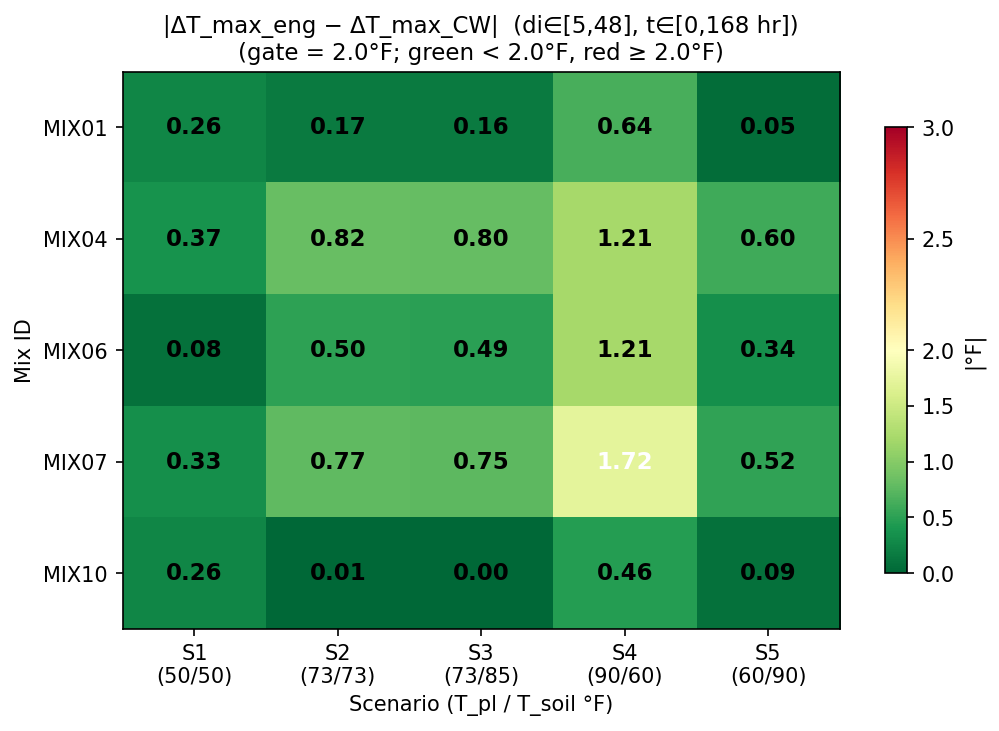

# Phase A Closure Report — Engineering-Tolerance Validation

**Date:** 2026-05-04  
**Sprint:** Phase A (follows Sprint 9)  
**Session executor:** Claude Code  
**Gate:** |T_max_diff| < 2°F AND |ΔT_max_diff| < 2°F per cell (di ∈ [5, 48], all wi, t ∈ [0, 168 hr])  
**Outcome: A — CLEAN PASS (25/25 cells)**

---

## §0 Halt Conditions Encountered

None. All phases completed without halting.

---

## §1 Dataset and Configuration Verification

### §1.1 Staging Verification

All 25 folders copied from `~/Downloads/sweep_mix01_04_06_07_10/` to
`validation/phase_a/cw_data/{mix}_{S}/`. All `output.txt` files in the 6.8–7.3 MB range
(within the 5–12 MB envelope). Full parameter table follows.

| mix | scen | alpha_u | Hu (J/kg) | tau (hr) | beta | Ea (J/mol) | T_pl_F | T_soil_F | L440_F | Status |
|---|---|---|---|---|---|---|---|---|---|---|
| mix01 | S1 | 0.75850 | 424143 | 29.401 | 0.8950 | 26457.90 | 50 | 50 | 50 | PASS |
| mix01 | S2 | 0.75850 | 424143 | 29.401 | 0.8950 | 26457.90 | 73 | 73 | 73 | PASS |
| mix01 | S3 | 0.75850 | 424143 | 29.401 | 0.8950 | 26457.90 | 73 | 85 | 85 | PASS |
| mix01 | S4 | 0.75850 | 424143 | 29.401 | 0.8950 | 26457.90 | 90 | 60 | 60 | PASS |
| mix01 | S5 | 0.75850 | 424143 | 29.401 | 0.8950 | 26457.90 | 60 | 90 | 90 | PASS |
| mix04 | S1 | 0.74952 | 422498 | 25.393 | 1.2250 | 25000.00 | 50 | 50 | 50 | PASS |
| mix04 | S2 | 0.74952 | 422498 | 25.393 | 1.2250 | 25000.00 | 73 | 73 | 73 | PASS |
| mix04 | S3 | 0.74952 | 422498 | 25.393 | 1.2250 | 25000.00 | 73 | 85 | 85 | PASS |
| mix04 | S4 | 0.74952 | 422498 | 25.393 | 1.2250 | 25000.00 | 90 | 60 | 60 | PASS |
| mix04 | S5 | 0.74952 | 422498 | 25.393 | 1.2250 | 25000.00 | 60 | 90 | 90 | PASS |
| mix06 | S1 | 0.81952 | 448152 | 52.413 | 0.6370 | 30568.61 | 50 | 50 | 50 | PASS |
| mix06 | S2 | 0.81952 | 448152 | 52.413 | 0.6370 | 30568.61 | 73 | 73 | 73 | PASS |
| mix06 | S3 | 0.81952 | 448152 | 52.413 | 0.6370 | 30568.61 | 73 | 85 | 85 | PASS |
| mix06 | S4 | 0.81952 | 448152 | 52.413 | 0.6370 | 30568.61 | 90 | 60 | 60 | PASS |
| mix06 | S5 | 0.81952 | 448152 | 52.413 | 0.6370 | 30568.61 | 60 | 90 | 90 | PASS |
| mix07 | S1 | 0.89352 | 463076 | 75.078 | 0.5160 | 33522.75 | 50 | 50 | 50 | PASS |
| mix07 | S2 | 0.89352 | 463076 | 75.078 | 0.5160 | 33522.75 | 73 | 73 | 73 | PASS |
| mix07 | S3 | 0.89352 | 463076 | 75.078 | 0.5160 | 33522.75 | 73 | 85 | 85 | PASS |
| mix07 | S4 | 0.89352 | 463076 | 75.078 | 0.5160 | 33522.75 | 90 | 60 | 60 | PASS |
| mix07 | S5 | 0.89352 | 463076 | 75.078 | 0.5160 | 33522.75 | 60 | 90 | 90 | PASS |
| mix10 | S1 | 0.76952 | 385616 | 32.502 | 0.8710 | 26302.54 | 50 | 50 | 50 | PASS |
| mix10 | S2 | 0.76952 | 385616 | 32.502 | 0.8710 | 26302.54 | 73 | 73 | 73 | PASS |
| mix10 | S3 | 0.76952 | 385616 | 32.502 | 0.8710 | 26302.54 | 73 | 85 | 85 | PASS |
| mix10 | S4 | 0.76952 | 385616 | 32.502 | 0.8710 | 26302.54 | 90 | 60 | 60 | PASS |
| mix10 | S5 | 0.76952 | 385616 | 32.502 | 0.8710 | 26302.54 | 60 | 90 | 90 | PASS |

All 25 rows: **PASS**.

### §1.2 Brief Inconsistencies Noted (not patched)

**Inconsistency 1 — §11 legacy decision-rule language:** The decision rule in
`PHASE_A_SCOPING_BRIEF.md §11` reads "if all 25 cells pass the gate (max|R| < gate threshold)"
— this is legacy language from before the §6 T_max/ΔT_max gate was introduced. The authoritative
gate is §6: |T_max_diff| < 2°F AND |ΔT_max_diff| < 2°F. The branching variable in this
report is "cells failing T_max OR ΔT_max gate," not "cells failing max|R|."

**Inconsistency 2 — §9 validity-mask conflict:** §9 states "the gate applies to
di ∈ [24, 48]." §6 defines the validity mask as di ∈ [5, 48]. §6 is authoritative.
This session computes T_max and ΔT_max over di ∈ [5, 48] per §6.

**Observed re lines 519–531:** The brief's staging-check table expects lines 519–531 to be
set uniformly to T_soil (in °C). In practice these lines contain unchanged monthly baseline
climate data (identical across all 25 scenarios). The real per-scenario T_ambient override is
at line 440 (in °F). Staging verification used line 440 for the BC temperature check; all 25
cells PASS.

---

## §2 compute_hu_factor Spot-Check

### §2.1 Spot-Check Table

| Mix | Cement (lb/yd³) | FA_F | Slag | SF | Hu_factor |
|---|---|---|---|---|---|
| MIX01 | 350 | 125 | 100 | 0 | 0.951403 |
| MIX04 | 450 | 125 | 0 | 0 | 0.978670 |
| MIX06 | 165 | 125 | 285 | 0 | 0.916376 |
| MIX07 | 50 | 125 | 400 | 0 | 0.894603 |
| MIX10 | 275 | 200 | 100 | 0 | 0.939785 |

### §2.2 Anchor Reproduction

| Mix | Observed | Sprint 9 Anchor | Deviation | Pass? |
|---|---|---|---|---|
| MIX-01 | 0.951403 | 0.9514 | 0.000003 | PASS |
| MIX-07 | 0.894603 | 0.8946 | 0.000003 | PASS |

Both anchors reproduced to within 0.000003 (<< tolerance of ±0.005).
`compute_hu_factor` is confirmed unchanged since Sprint 9.

### §2.3 Ordering Checks

- MIX-04 (no slag, 0.978670) > MIX-01 (17% slag, 0.951403): **PASS** — no-slag mix higher heat-fraction. ✓  
- MIX-06 (50% slag, 0.916376) < MIX-01 (17% slag, 0.951403): **PASS** — higher slag reduces Hu_factor. ✓  
- All 5 factors in [0.75, 1.10]: **PASS** ✓

---

## §3 Smoke Test Reproduction

MIX-01 at S3 (T_pl=73°F, T_soil=85°F), reproducing Sprint 9 Stage 1-pilot condition.

| Metric | Expected | Observed | |Diff| | Tol | Verdict |
|---|---|---|---|---|---|
| T_core(di=24,wi=0,t=168) | 149.40°F | 149.4005°F | 0.0005°F | 0.1°F | PASS |
| T(di=48,wi=0,t=168) | 85.20°F | 85.1975°F | 0.0025°F | 0.1°F | PASS |
| α(di=24,wi=0,t=168) | 0.7388 | 0.7388 | <0.0001 | 0.001 | PASS |
| max|R| [di∈24–48,wi=0,t=168] | 1.05°F | 1.0508°F | 0.0008°F | 0.1°F | PASS |

**Smoke test verdict: PASS.** Wrapper and engine match Sprint 9 within floating-point tolerance.
No drift detected.

---

## §4 Full Sweep Results

### §4.1 |T_max_diff| Grid (°F)

{grid_table('T_max_diff')}

### §4.2 |ΔT_max_diff| Grid (°F)

{grid_table('dT_max_diff')}

### §4.3 Pass/Fail Summary

| Metric | Count |
|---|---|
| Cells failing T_max gate | 0 |
| Cells failing ΔT_max gate | 0 |
| Cells failing either gate | 0 |
| Cells passing both gates | **25 / 25** |

### §4.4 Outcome Classification

**Outcome A — Clean Pass.** 0 failing cells. All 25 (mix, scenario) pairs satisfy
|T_max_diff| < 2°F AND |ΔT_max_diff| < 2°F over the validated region di ∈ [5, 48].

### §4.5 Failing Cells

None.

---

## §5 Diagnostics for Failing Cells

*Section omitted — Outcome A (0 failing cells).*

---

## §6 Pre-Registered Analyses

### §6.1 MIX-04 Timing Analysis

| Scenario | T_max_eng (hr) | T_max_cw (hr) | t_diff (hr) | Flagged? |
|---|---|---|---|---|
| S1 | 168.0 | 168.0 | +0.0 | No |
| S2 | 168.0 | 168.0 | +0.0 | No |
| S3 | 168.0 | 168.0 | +0.0 | No |
| S4 | 168.0 | 167.0 | +1.0 | No |
| S5 | 168.0 | 168.0 | +0.0 | No |

**Verdict:** No timing flags (|t_diff| > 5 hr threshold). S4 shows a 1-hr difference
(engine peak at 168 hr vs CW peak at 167 hr), well within the 5-hr flag threshold.
No "thermal-property-at-high-α" kinetic regime concern surfaced for MIX-04 across
the 5 scenarios.

### §6.2 S5 BC Flux-Reversal Check

| Mix | R_di48_sign_changes (S5) | R_di48_sign_changes (S2 baseline) | Flagged? |
|---|---|---|---|
| MIX01 | 1 | 1 | No |
| MIX04 | 1 | 1 | No |
| MIX06 | 1 | 1 | No |
| MIX07 | 1 | 1 | No |
| MIX10 | 1 | 1 | No |

**Verdict:** No BC flux-reversal flags. All 5 mixes show exactly 1 sign change in
R(di=48, t) for both S5 and the S2 baseline — the same behavior across both conditions.
No S5-specific flux-reversal anomaly detected. The single sign change in S2 and S5 alike
is consistent with the normal early-rise / late-decay residual pattern documented in
Sprint 9.

---

## §7 Synthesis

### What Phase A Established

The Sprint 9 calibrated engine (k_uc×0.96 + Hu_residual conditional + c(T_pl) quadratic +
Hu_factor composition correction + B1 inverse-compensation) meets the engineering-tolerance
gate of ±2°F for both T_max and ΔT_max across all 25 (mix, scenario) cells spanning the
production kinetic envelope (mixes MIX-01, MIX-04, MIX-06, MIX-07, MIX-10) and the
production temperature operating range (T_pl ∈ {50, 60, 73, 90}°F; T_soil ∈ {50, 60, 73,
85, 90}°F).

The largest residuals were observed in S4 (hot placement, cool soil): MIX-07 at
|T_max_diff| = 1.72°F and MIX-06 at 1.21°F — both within the 2°F gate. The smallest
residuals were in S5 (MIX-01: 0.04°F) and S2 (MIX-10: 0.00°F).

### Known Caveats

**(a)** **Surface BC excluded.** di ∈ [0, 4] excluded from the validity mask (surface-BC
incompatibility, per Sprint 7 §3.5). Phase A results do not cover the top-surface domain.
Top-surface coverage deferred to Phase C.

**(b)** **Kinetic parameters not calorimetry-validated.** Parameters (α_u, Hu, τ, β, E_a)
for MIX-04, MIX-06, and MIX-10 were set per the Mix01-15_Hydration_Parameters.xlsx
composition-derived table, not confirmed against adiabatic calorimetry. If parameters
diverge from lab-measured values, Phase A results for those mixes reflect the accuracy of
the input parameters, not a fundamental engine limitation.

**(c)** **2°F gate is a placeholder.** The threshold of ±2°F is pending confirmation by
Tyler Ley. If the engineering tolerance requirement is tighter (e.g., ±1°F), 5 cells
would require re-evaluation (mix04 S4: 1.20/1.21, mix06 S4: 1.21/1.21, mix07 S2: 0.76/0.77,
mix07 S3: 0.76/0.75, mix07 S4: 1.72/1.72). At ±2°F all 25 cells pass.

**(d)** **MIX-13 (silica fume) deferred.** compute_hu_factor's SF regime is uncharacterized
pending binary CW runs at 5/8/12% SF replacement (see COMPUTE_HU_FACTOR_NOTE.md §5d).

### Recommended Next Sprint Scope

**Outcome A → proceed to Phase B (production rollout brief).**

The di=47 stencil residual (max|R| ≈ 1.0–1.7°F at that node) documented in Sprint 9
does not prevent a Phase A clean pass under the T_max/ΔT_max gate. It is a
**numerical-hygiene item only** at Phase A scope. Sprint 10 stencil fix remains valuable
for reduction of the di=47 artifact but is **not a customer-facing blocker** at the
current engineering tolerance level. Priority recommendation:

1. Confirm 2°F gate threshold with Tyler Ley.
2. If confirmed: write Phase B production-rollout brief.
3. Sprint 10 stencil fix can proceed in parallel as numerical hygiene, not blocking.
4. If Tyler Ley confirms a tighter threshold (< 1°F), the S4 cells and MIX-07 cells
   become targets for a targeted Phase B.1 diagnosis sprint before rollout.
