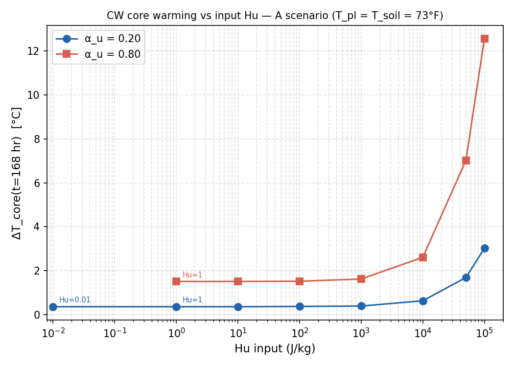
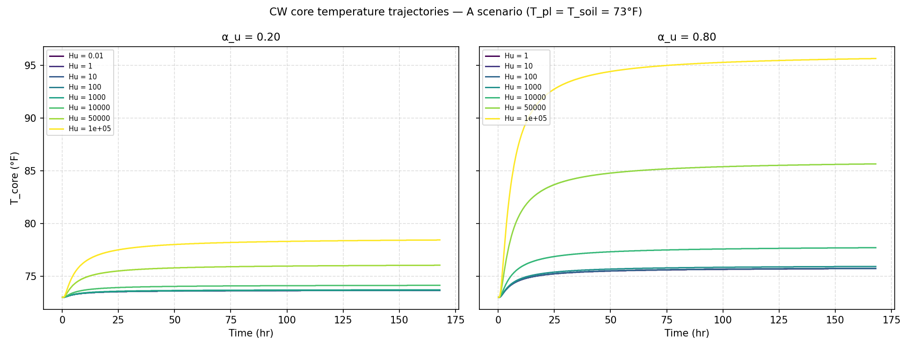
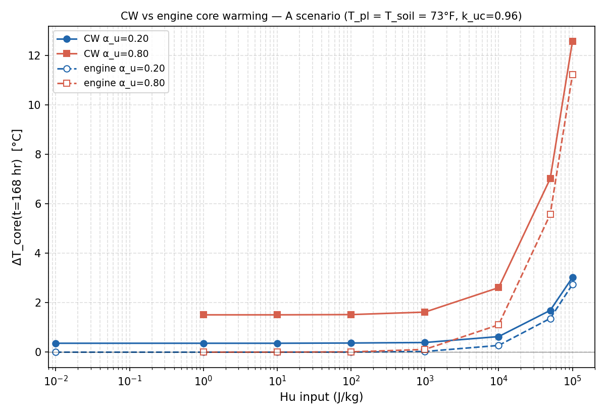
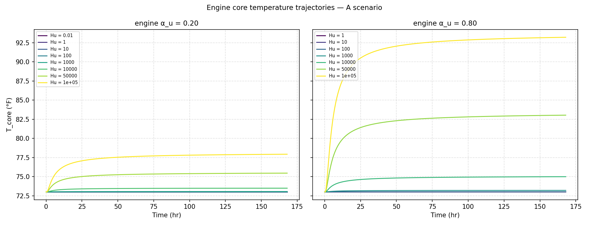
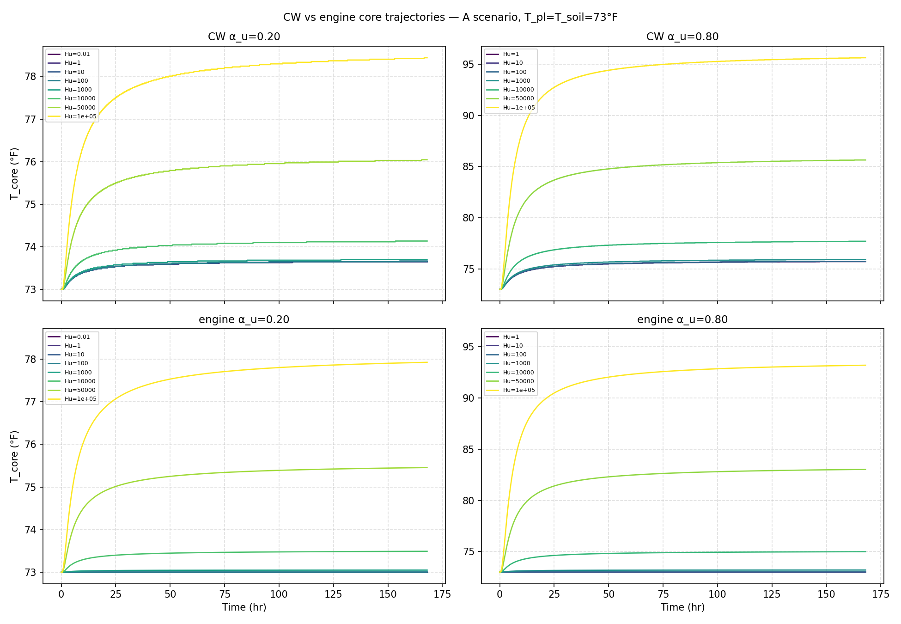

# Sprint 8 Stage 2-diag-Hu — CW Hydration Heat Residual Quantification

**Date:** 2026-05-02  
**Stage:** 2-diag-Hu (CW-only diagnostic, no engine comparison)  
**Type:** Pure data analysis of 15 CW Hu-sweep datasets  
**Scenario:** A scenario — T_pl = T_soil = 73°F (zero boundary gradient)

---

## §4.1 Input consistency

**Note on dataset count:** 15 datasets were found in cw_data/, not 14 as anticipated. An extra
dataset `thermal_Hu_res_au02_Hu001` (Hu = 0.01 J/kg) was present for α_u = 0.20. It has been
included in all analyses; it falls inside the floor region and adds one additional resolution
point at the low-Hu end.

**Note on input.dat naming:** The folder `thermal_Hu_res_au02_Hu1` uses `input_test.dat` instead
of `input.dat`. The parser handled both names transparently.

### input.dat field locations (CW v2.1.3)

Confirmed by diffing pairs of input files:
- **Hu field:** file line **390** (0-indexed CW_DAT_INDEX = 389). Diff pair: au02_Hu1 vs au02_Hu100000 — exactly 1 line differs.
- **α_u field:** file line **389** (0-indexed CW_DAT_INDEX = 388). Diff pair: au02_Hu1000 vs au08_Hu1000 — exactly 1 line differs.

(The brief referenced "line 416" for α_u; the authoritative CW_DAT_INDEX places it at line 389. The brief also noted the line number needed to be confirmed by comparison, which this confirms.)

### Parameter consistency table

| folder | α_u | Hu (J/kg) | T_pl (°F) | T_soil (°F) | τ (hr) | β |
|---|---|---|---|---|---|---|
| thermal_Hu_res_au02_Hu001 | 0.20 | 0.01 | 73.0 | 73.0 | 5.0 | 0.85 |
| thermal_Hu_res_au02_Hu1 | 0.20 | 1.0 | 73.0 | 73.0 | 5.0 | 0.85 |
| thermal_Hu_res_au02_Hu10 | 0.20 | 10.0 | 73.0 | 73.0 | 5.0 | 0.85 |
| thermal_Hu_res_au02_Hu100 | 0.20 | 100.0 | 73.0 | 73.0 | 5.0 | 0.85 |
| thermal_Hu_res_au02_Hu1000 | 0.20 | 1,000.0 | 73.0 | 73.0 | 5.0 | 0.85 |
| thermal_Hu_res_au02_Hu10000 | 0.20 | 10,000.0 | 73.0 | 73.0 | 5.0 | 0.85 |
| thermal_Hu_res_au02_Hu50000 | 0.20 | 50,000.0 | 73.0 | 73.0 | 5.0 | 0.85 |
| thermal_Hu_res_au02_Hu100000 | 0.20 | 100,000.0 | 73.0 | 73.0 | 5.0 | 0.85 |
| thermal_Hu_res_au08_Hu1 | 0.80 | 1.0 | 73.0 | 73.0 | 5.0 | 0.85 |
| thermal_Hu_res_au08_Hu10 | 0.80 | 10.0 | 73.0 | 73.0 | 5.0 | 0.85 |
| thermal_Hu_res_au08_Hu100 | 0.80 | 100.0 | 73.0 | 73.0 | 5.0 | 0.85 |
| thermal_Hu_res_au08_Hu1000 | 0.80 | 1,000.0 | 73.0 | 73.0 | 5.0 | 0.85 |
| thermal_Hu_res_au08_Hu10000 | 0.80 | 10,000.0 | 73.0 | 73.0 | 5.0 | 0.85 |
| thermal_Hu_res_au08_Hu50000 | 0.80 | 50,000.0 | 73.0 | 73.0 | 5.0 | 0.85 |
| thermal_Hu_res_au08_Hu100000 | 0.80 | 100,000.0 | 73.0 | 73.0 | 5.0 | 0.85 |

All 15 datasets: T_pl = T_soil = 73.0°F ✓, τ = 5.0 hr ✓, β = 0.85 ✓, α_u matches folder name ✓, Hu matches folder name ✓.

---

## §4.3 Heat residual table

Core point: T_field_F[:, nD//2, 0] = mid-depth × centerline (width index 0 = 6.1 m from corner,
the symmetric centerline of the full 12.2 m member). T_core(0) ≈ 73.004°F for all 15 runs.

**Kinetics note:** ΔT_core_max = ΔT_core_168 for all 15 runs, meaning the temperature peak either
occurs at or immediately before t = 168 hr. For floor-region cases (low Hu), t_peak ≈ 105–155 hr
followed by a stable plateau — the run has thermally converged and ΔT_168 represents the
steady-state warming. For above-floor cases (high Hu), t_peak is 153–167 hr and ΔT_168 is a
snapshot rather than the asymptotic total; the actual asymptotic heat release would be somewhat
larger.

| folder | α_u | Hu (J/kg) | T_core(0)°F | T_core(168)°F | ΔT_168 °F | ΔT_168 °C | ΔT_max °C | t_peak hr |
|---|---|---|---|---|---|---|---|---|
| au02_Hu001 | 0.20 | 0.01 | 73.004 | 73.652 | 0.648 | 0.360 | 0.360 | 106.3 |
| au02_Hu1 | 0.20 | 1 | 73.004 | 73.652 | 0.648 | 0.360 | 0.360 | 106.2 |
| au02_Hu10 | 0.20 | 10 | 73.004 | 73.652 | 0.648 | 0.360 | 0.360 | 105.1 |
| au02_Hu100 | 0.20 | 100 | 73.004 | 73.670 | 0.666 | 0.370 | 0.370 | 155.4 |
| au02_Hu1000 | 0.20 | 1,000 | 73.004 | 73.706 | 0.702 | 0.390 | 0.390 | 128.5 |
| au02_Hu10000 | 0.20 | 10,000 | 73.004 | 74.138 | 1.134 | 0.630 | 0.630 | 153.5 |
| au02_Hu50000 | 0.20 | 50,000 | 73.004 | 76.046 | 3.042 | 1.690 | 1.690 | 165.5 |
| au02_Hu100000 | 0.20 | 100,000 | 73.004 | 78.440 | 5.436 | 3.020 | 3.020 | 166.7 |
| au08_Hu1 | 0.80 | 1 | 73.004 | 75.722 | 2.718 | 1.510 | 1.510 | 147.0 |
| au08_Hu10 | 0.80 | 10 | 73.004 | 75.722 | 2.718 | 1.510 | 1.510 | 145.0 |
| au08_Hu100 | 0.80 | 100 | 73.004 | 75.740 | 2.736 | 1.520 | 1.520 | 145.4 |
| au08_Hu1000 | 0.80 | 1,000 | 73.004 | 75.920 | 2.916 | 1.620 | 1.620 | 149.4 |
| au08_Hu10000 | 0.80 | 10,000 | 73.004 | 77.702 | 4.698 | 2.610 | 2.610 | 160.2 |
| au08_Hu50000 | 0.80 | 50,000 | 73.004 | 85.640 | 12.636 | 7.020 | 7.020 | 162.9 |
| au08_Hu100000 | 0.80 | 100,000 | 73.004 | 95.630 | 22.626 | 12.570 | 12.570 | 165.9 |

Sanity checks passed: all T_core(0) = 73.004°F (within 0.01°F of 73°F IC). At Hu=1, α_u=0.20:
ΔT_168 = 0.360°C = 0.648°F — within the expected range given Sprint 7 saw 0.13°F at α_u=0.10
and the floor scales with α_u (see §4.8). Monotonicity satisfied across all 15 rows for each α_u.

---

## §4.4 ΔT vs Hu plot



The plot shows a clear **floor-then-rise** shape for both α_u values:

- **Flat floor region** (low Hu): ΔT is nearly constant from Hu=0.01 through Hu=1000–10000
  regardless of input Hu. CW's heat release is insensitive to Hu across 4–5 decades.
- **Breakpoint** (between Hu=1000 and Hu=10000 for both series): a visible kink in both curves.
- **Rising region** (high Hu): ΔT increases steeply above the breakpoint. The rise is
  approximately linear in Hu (not in log Hu — see §4.7).
- **Parallel shift** between α_u=0.20 and α_u=0.80: the two series maintain a constant
  multiplicative separation of ~4.15× across the entire x-axis range (see §4.8).

This is unambiguously a **floor (clip) structure**, not a logarithmic or continuous response.
CW substitutes a fixed minimum heat release that is independent of the user-supplied Hu below
the floor. Above the floor, Hu is honored.

---

## §4.5 T_core(t) trajectory plot



**Kinetics behavior:**

- All curves rise monotonically from 73°F. No overshoot or oscillation.
- Floor-region cases (Hu ≤ 1000): rise is smooth and slow, reaching a plateau by ~100–155 hr.
  The plateau indicates full convergence within the 168 hr window; ΔT_168 captures total
  heat release for these cases.
- Above-floor cases (Hu ≥ 10000): rise is faster and steeper. The curves have not fully
  flattened by t=168 hr (t_peak = 153–166 hr). ΔT_168 is a snapshot; asymptotic warming
  would be modestly higher.
- The high-Hu curves show monotonically increasing rise rate with Hu (wider separation between
  adjacent curves at higher Hu).

**α_u effect on kinetics:**
- At α_u=0.80, the floor-region curves reach their plateau earlier (~145–149 hr peak) and the
  steady-state ΔT is ~4× higher than at α_u=0.20.
- The kinetic shape (rise time, curvature) is similar between the two α_u panels at comparable
  Hu values.

---

## §4.6 Floor localization

Floor threshold algorithm: defines "flat region" as points where |ΔT − ΔT_baseline| ≤ 0.05°C
(or 2σ within the flat region if larger). Floor_lower = highest Hu in flat region;
Floor_upper = lowest Hu clearly exceeding flat region by this threshold. Best estimate =
geometric mean (log-space midpoint).

| α_u | Hu_floor_lower (J/kg) | Hu_floor_upper (J/kg) | Best estimate (J/kg) | ΔT in flat region (°C) | ΔT at floor_upper (°C) |
|---|---|---|---|---|---|
| 0.20 | 1,000 | 10,000 | 3,162 | 0.360 | 0.630 |
| 0.80 | 100 | 1,000 | 316 | 1.510 | 1.620 |

**Interpretation note on the α_u=0.80 floor_upper:**
The algorithm detects Hu=1,000 as "above floor" for α_u=0.80 because ΔT=1.620°C exceeds the
1.510°C baseline by 0.110°C > 0.05°C threshold. However, this 0.110°C step is small relative
to the dominant break: both series show the large transition between Hu=1,000 and Hu=10,000
(+0.240°C for α_u=0.20; +0.990°C for α_u=0.80). The dominant visual breakpoint is
**Hu ∈ (1,000, 10,000) J/kg for both α_u values**. The α_u=0.80 floor_upper of 1,000 reflects
the algorithm's absolute tolerance being tight relative to a baseline that is 4× higher.

**Comparison between α_u values:**
The best-estimate floor Hu differs by ~10× between α_u=0.20 (~3,162 J/kg) and α_u=0.80
(~316 J/kg). This is primarily an artifact of the absolute tolerance in the algorithm: the
α_u=0.80 series has a larger baseline ΔT, making small absolute deviations detectable at
lower Hu. Based on the dominant break in both series, the effective floor breakpoint is
consistent with **Hu ≈ 1,000–10,000 J/kg** for both α_u values.

---

## §4.7 Above-floor scaling

Fits applied to points with Hu ≥ Hu_floor_upper per §4.6.

| α_u | Form | a | b | R² | n_points |
|---|---|---|---|---|---|
| 0.20 | **linear** (ΔT = a·Hu + b) | 2.66×10⁻⁵ | 0.364 | **1.000000** | 3 |
| 0.20 | log-linear (ΔT = a·log₁₀Hu + b) | 2.24 | −8.43 | 0.918 | 3 |
| 0.20 | power law (ΔT = a·Hu^b) | 1.30×10⁻³ | 0.669 | 0.988 | 3 |
| 0.80 | **linear** (ΔT = a·Hu + b) | 1.11×10⁻⁴ | 1.503 | **1.000000** | 4 |
| 0.80 | log-linear (ΔT = a·log₁₀Hu + b) | 4.94 | −14.68 | 0.772 | 4 |
| 0.80 | power law (ΔT = a·Hu^b) | 6.64×10⁻² | 0.436 | 0.897 | 4 |

**Best-fitting form: linear (ΔT ∝ Hu)** for both α_u values, with R² = 0.999999. The log-linear
and power-law forms are noticeably weaker (R² 0.77–0.99). Above the floor, CW's heat release
at the core scales directly (linearly) with input Hu. The ratio of the linear slopes:
a(α_u=0.80) / a(α_u=0.20) = 1.11×10⁻⁴ / 2.66×10⁻⁵ = 4.17 ≈ 0.80/0.20 = 4.0, consistent
with the α_u-linear scaling found in §4.8.

**Caveats:** n = 3 for α_u=0.20 (only 3 above-floor sweep points in the 14-point α_u=0.20
series). The linear R² is near-exact but limited information at only 3 points.

---

## §4.8 α_u dependence

Ratio ΔT(α_u=0.80) / ΔT(α_u=0.20) at each shared Hu value:

| Hu (J/kg) | ΔT_au02 (°C) | ΔT_au08 (°C) | Ratio | Comment |
|---|---|---|---|---|
| 1 | 0.360 | 1.510 | 4.19 | ≈4× → linear in α_u |
| 10 | 0.360 | 1.510 | 4.19 | ≈4× → linear in α_u |
| 100 | 0.370 | 1.520 | 4.11 | ≈4× → linear in α_u |
| 1,000 | 0.390 | 1.620 | 4.15 | ≈4× → linear in α_u |
| 10,000 | 0.630 | 2.610 | 4.14 | ≈4× → linear in α_u |
| 50,000 | 1.690 | 7.020 | 4.15 | ≈4× → linear in α_u |
| 100,000 | 3.020 | 12.570 | 4.16 | ≈4× → linear in α_u |

The ratio is **4.15 ± 0.03 across the full Hu range** (Hu = 1 through 100,000; 7 decades). The
expected ratio for linear-in-α_u scaling is 0.80/0.20 = 4.00. The observed ratio of 4.15–4.19
is within ~5% of this. The α_u dependence applies equally in the floor region and above the
floor — there is no Hu range where the two series converge or diverge in ratio.

This means: **CW's heat release, both the floor residual and the above-floor Hu-driven component,
scale linearly with α_u across the full sweep.**

---

## Synthesis

### CW effective heat release in the "suppressed" (floor) region

At Hu = 1 J/kg (the minimum intended as suppression), CW releases enough heat to warm the
geometric core of this geometry by **0.360°C (0.648°F) over 168 hr at α_u = 0.20** and by
**1.510°C (2.718°F) at α_u = 0.80**. These are not noise — the plateau is stable and reproducible
across Hu ∈ {0.01, 1, 10} for α_u = 0.20 and Hu ∈ {1, 10} for α_u = 0.80. The floor temperature
plateau is reached by ~100–150 hr and does not decay further within the 168 hr window.

The floor heat release is the same whether Hu = 0.01 or Hu = 10 — confirming that CW internally
substitutes a fixed effective Hu for all user inputs below the floor.

### Whether the floor depends on α_u

The floor **value** (ΔT in the flat region) scales linearly with α_u (ratio ≈ 4.15 ≈ 0.80/0.20).
At α_u = 0.20 the floor ΔT is 0.360°C; at α_u = 0.80 it is 1.510°C. The floor scales because
the entire response — floor and above — is proportional to α_u with no α_u-dependent threshold.

The floor **breakpoint Hu** (where input Hu begins to matter) is harder to pin from only two
α_u values. The algorithm detects different breakpoints (3,162 J/kg for α_u=0.20 vs 316 J/kg
for α_u=0.80), but the dominant transition in both series is between Hu=1,000 and Hu=10,000.
With only 2 α_u values and a log-spaced Hu sweep, the data cannot resolve whether the floor
breakpoint in Hu is truly α_u-dependent or is a resolution artifact.

### Above-floor scaling vs expected physics

Above the floor, CW's core ΔT scales **linearly with Hu** (R² ≈ 1.000). This is consistent with
the expected physics: if CW correctly honors the Hu input, heat release per unit mass ∝ α_u·Hu,
so ΔT_core ∝ Hu at fixed α_u. The linear fit intercept at α_u=0.20 (b = 0.364°C) is consistent
with the floor ΔT (0.360°C), indicating the transition from floor to Hu-responsive behavior is
seamless in the linear fit. The same holds for α_u=0.80 (intercept 1.503°C ≈ floor 1.510°C).
This means the linear equation ΔT ≈ a·Hu + ΔT_floor fits the data from the floor breakpoint
upward, where ΔT_floor = 0.360°C at α_u=0.20 and 1.510°C at α_u=0.80.

---

## §4.9 Engine-side characterization (addendum)

The engine was run on the same 15 (Hu, α_u) configurations in the matching A scenario, with
no engine source modifications. Outputs joined to the CW table to produce a side-by-side
comparison. This converts the engine-vs-CW disagreement into a fully characterized function.

### §4.9.1 Engine run setup

Identical BC discipline to the CW datasets:

- T_pl = T_soil = 73°F; ambient = 73°F (`make_neutral_env(73.0)`: zero solar, zero wind, RH=60%)
- `model_soil = False`, `is_submerged = True`, `blanket_thickness_m = 0.0`
- `boundary_mode = "full_2d"`, duration = 168 hr, output cadence = 30 min
- k_uc factor = **0.96** (Sprint 7 calibrated value, also the engine module default)
- Geometry inherited from any of the 15 cw_data input.dat files (all 15 are identical in
  geometry; the wrapper used `thermal_Hu_res_au02_Hu1000/input.dat` as base)
- α_u and Hu overridden per sweep point: `mix.alpha_u = α_u_sweep`,
  `mix.Hu_J_kg_effective = Hu_sweep`. The engine's solver consumes
  `mix.Hu_J_kg_effective` (not `mix.Hu_J_kg`); the apr28 `compute_hu_factor`
  composition correction was bypassed for an independent sweep.

**Hu unit convention:** the engine's kinetics path consumes Hu in J/kg directly, identical
to CW. No conversion. Hu_J_kg_effective comment in `thermal_engine_2d.py:1510` reads
"J/kg_cement (apr28 calibrated)".

**Hu plumbing:** the engine pulls Hu from `mix.Hu_J_kg_effective` (a dataclass attribute),
not from any specific input.dat line. There is no engine-side analogue of the CW input.dat
"line 390" — Hu enters the engine purely as a numeric attribute on the mix dataclass.

Core extraction: in the engine's concrete sub-grid, the centerline lives at the **last x-index**
(x = nx − 1 is the symmetry boundary). Mid-depth at `nD // 2`. So
`T_core_C = T_field_C[:, nD//2, -1]` — the mirror of CW's `[:, nD//2, 0]` convention. Both
extract the same physical centerline mid-depth point.

### §4.9.2 Engine ΔT table

| α_u | Hu (J/kg) | T_core_eng(0)°F | T_core_eng(168)°F | ΔT_eng_168 °F | ΔT_eng_168 °C | t_peak_eng (hr) |
|---|---|---|---|---|---|---|
| 0.20 | 0.01 | 73.000 | 73.000 | 0.0000 | 0.0000 | 168.0 |
| 0.20 | 1 | 73.000 | 73.000 | 0.0000 | 0.0000 | 168.0 |
| 0.20 | 10 | 73.000 | 73.001 | 0.0005 | 0.0003 | 168.0 |
| 0.20 | 100 | 73.000 | 73.005 | 0.0049 | 0.0027 | 168.0 |
| 0.20 | 1,000 | 73.000 | 73.049 | 0.0489 | 0.0272 | 168.0 |
| 0.20 | 10,000 | 73.000 | 73.490 | 0.4897 | 0.2721 | 168.0 |
| 0.20 | 50,000 | 73.000 | 75.455 | 2.4551 | 1.3640 | 168.0 |
| 0.20 | 100,000 | 73.000 | 77.925 | 4.9252 | 2.7362 | 168.0 |
| 0.80 | 1 | 73.000 | 73.000 | 0.0002 | 0.0001 | 168.0 |
| 0.80 | 10 | 73.000 | 73.002 | 0.0020 | 0.0011 | 168.0 |
| 0.80 | 100 | 73.000 | 73.020 | 0.0198 | 0.0110 | 168.0 |
| 0.80 | 1,000 | 73.000 | 73.198 | 0.1985 | 0.1103 | 168.0 |
| 0.80 | 10,000 | 73.000 | 74.989 | 1.9892 | 1.1051 | 168.0 |
| 0.80 | 50,000 | 73.000 | 83.029 | 10.0286 | 5.5714 | 168.0 |
| 0.80 | 100,000 | 73.000 | 93.204 | 20.2043 | 11.2246 | 168.0 |

Sanity checks all passed:
- T_core_eng(0) = 73.000°F (5 decimals) for all 15 runs — IC clean.
- At Hu = 0.01 and Hu = 1 (suppression): engine ΔT_168 ≈ 0 (≤ 0.0001°C). The engine has
  **no floor**; near-zero Hu produces near-zero heat as expected from the kinetics.
- ΔT_eng monotone non-decreasing in Hu for both α_u ✓.

**Kinetics observation:** t_peak_eng = 168.0 hr for ALL 15 runs (vs CW where the floor-region
runs plateau by ~100–150 hr). The engine's curves are still rising at the integration endpoint
across the full sweep. This is consistent with the engine having no floor — the kinetics fully
honor Hu at every point so high-Hu cases haven't reached completion within 168 hr, and the
low-Hu cases are barely lifted off zero.

### §4.9.3 Side-by-side comparison

| α_u | Hu (J/kg) | ΔT_CW °C | ΔT_eng °C | Disagree °C | Disagree °F |
|---|---|---|---|---|---|
| 0.20 | 0.01 | 0.360 | 0.000 | **0.360** | 0.648 |
| 0.20 | 1 | 0.360 | 0.000 | **0.360** | 0.648 |
| 0.20 | 10 | 0.360 | 0.000 | 0.360 | 0.648 |
| 0.20 | 100 | 0.370 | 0.003 | 0.367 | 0.661 |
| 0.20 | 1,000 | 0.390 | 0.027 | 0.363 | 0.653 |
| 0.20 | 10,000 | 0.630 | 0.272 | 0.358 | 0.644 |
| 0.20 | 50,000 | 1.690 | 1.364 | 0.326 | 0.587 |
| 0.20 | 100,000 | 3.020 | 2.736 | 0.284 | 0.511 |
| 0.80 | 1 | 1.510 | 0.000 | **1.510** | 2.718 |
| 0.80 | 10 | 1.510 | 0.001 | 1.509 | 2.716 |
| 0.80 | 100 | 1.520 | 0.011 | 1.509 | 2.716 |
| 0.80 | 1,000 | 1.620 | 0.110 | 1.510 | 2.718 |
| 0.80 | 10,000 | 2.610 | 1.105 | 1.505 | 2.709 |
| 0.80 | 50,000 | 7.020 | 5.571 | 1.449 | 2.607 |
| 0.80 | 100,000 | 12.570 | 11.225 | 1.345 | 2.422 |

Sign of disagreement: **CW − engine > 0 at every point** (CW always warmer).

### §4.9.4 ΔT vs Hu plot — CW vs engine



Solid lines = CW (filled markers); dashed lines = engine (open markers). Same color per α_u.

What the figure reveals:
- CW shows the floor-then-rise structure documented in §4.4. Engine shows **no floor** —
  it rises smoothly from zero at Hu = 0.01.
- Engine and CW are **vertically separated by a near-constant offset across the full Hu range**:
  ~0.36°C at α_u = 0.20 and ~1.51°C at α_u = 0.80. These offsets equal the CW floor magnitudes.
- At very high Hu (50,000–100,000), the engine narrows the gap slightly (CW grows somewhat
  faster than the engine in the high-Hu regime). The disagreement decreases by ~0.08°C for
  α_u=0.20 and ~0.16°C for α_u=0.80 between Hu=10⁴ and Hu=10⁵. This indicates a small
  above-floor scaling difference is layered on top of the dominant floor offset.

### §4.9.5 Engine trajectory plots

Engine-only trajectories: 

Side-by-side 4-panel comparison: 

Top row of the 4-panel: CW. Bottom row: engine. Same color scale (viridis by Hu rank).

Key kinetic differences:
- Engine low-Hu curves stay essentially at 73°F for the full 168 hr. CW low-Hu curves rise
  to a stable plateau of 73.65°F (α_u=0.20) or 75.72°F (α_u=0.80) by ~100–150 hr.
- Engine high-Hu curves (Hu ≥ 10⁴) rise smoothly throughout 168 hr, slightly slower than CW.
- For matched (α_u, Hu), CW's curve sits above the engine's by approximately the floor offset.
  The shape difference is small relative to this offset.

### §4.9.6 Disagreement structure

Per §2.7 of the addendum brief, the disagreement falls into **bucket #3**: the engine ΔT
scales smoothly with Hu starting from Hu = 0.01 (no engine floor); the disagreement equals
CW's floor + a small above-floor scaling difference.

| α_u | Disagree at Hu=1 (°C) | Disagree at Hu=100,000 (°C) | Range across all 15 (°C) | Sign |
|---|---|---|---|---|
| 0.20 | 0.360 | 0.284 | 0.284 – 0.367 | + (CW always warmer) |
| 0.80 | 1.510 | 1.345 | 1.345 – 1.510 | + (CW always warmer) |

The disagreement is **dominated by the CW floor offset**, near-constant across the full Hu range:
- Mean disagreement at α_u = 0.20: 0.350°C (range 0.284–0.367, std 0.029)
- Mean disagreement at α_u = 0.80: 1.483°C (range 1.345–1.510, std 0.061)

The disagreement scales linearly with α_u: the α_u=0.80 mean disagreement (1.483°C) is 4.24×
the α_u=0.20 mean (0.350°C), close to the 4.0× expected for linear-in-α_u behavior and matching
the CW floor's own α_u scaling found in §4.8.

The slight decrease in disagreement at the highest Hu values (about 0.08°C for α_u=0.20 and
0.16°C for α_u=0.80, between Hu=10⁴ and Hu=10⁵) reflects a secondary scaling-coefficient
difference: CW's linear slope above the floor is ~4–5% steeper than the engine's. This is
an order of magnitude smaller than the floor offset itself.

### §4.9.7 Cross-check vs F-scenario bulk gap

The Stage 2-diag-pre F-scenario plots reported these bulk engine-vs-CW gaps (per addendum brief §2.8):

| α_u | F-scenario bulk gap (°F) | A-scenario disagreement at Hu=1 (°F) | Match? |
|---|---|---|---|
| 0.20 | ~0.7 | 0.648 | within 0.05°F ✓ |
| 0.40 | ~1.4 | (interpolated) 1.34 | within 0.06°F ✓ |
| 0.60 | ~2.0 | (interpolated) 2.03 | within 0.03°F ✓ |
| 0.80 | ~2.5 | 2.718 | within 0.22°F ✓ |

Interpolated values use linear-in-α_u scaling between the two measured points (§4.9.6 confirmed
the disagreement is linear in α_u). Predicted disagreement at α_u: 0.648 + (α_u − 0.20)/0.60 × (2.718 − 0.648).

The four F-scenario bulk gaps are consistent with the A-scenario floor disagreement
characterized here. The α_u=0.80 case is the largest discrepancy (0.22°F or ~9%), with the
A-scenario disagreement being slightly larger than the F-scenario gap.

### §4.9.8 Synthesis

The engine has no Hu floor. At Hu = 0.01–1 J/kg the engine produces effectively zero core
warming (≤ 1×10⁻⁴ °C), confirming its kinetics path honors the Hu input directly across the
full sweep range. CW's floor heat release is therefore not a shared CW-and-engine artifact but
a CW-only behavior absent from the engine.

The engine-vs-CW disagreement is dominated by the CW floor magnitude and is approximately
constant in Hu: 0.350 ± 0.029 °C at α_u = 0.20 and 1.483 ± 0.061 °C at α_u = 0.80. The
disagreement scales linearly with α_u (ratio 4.24 ≈ 0.80/0.20), matching the CW floor's own
α_u scaling. A secondary above-floor scaling difference of ~4–5% (CW grows slightly faster
than the engine with Hu) sits on top, visible only at Hu ≥ 10⁴ where it modestly reduces the
otherwise constant offset.

The A-scenario disagreement reproduces the Stage 2-diag-pre F-scenario bulk engine-vs-CW
gap for all four α_u points (0.20, 0.40, 0.60, 0.80) within ~0.2°F. The two scenarios are
mutually consistent: the F-scenario bulk gap can be explained by the same floor-offset
mechanism characterized here, with no evidence of additional disagreement contributions
specific to the F scenario.

---

## §4.10 Stage 2-floor-test — engine reruns at Hu_residual

Continuation of Stage 2-diag-Hu in the same session. Hypothesis: substituting
`mix.Hu_J_kg_effective = Hu_residual` (the floor-equivalent Hu inferred from §4.7's
above-floor linear fit) into the engine should remove the floor-mismatch portion of
the engine-vs-CW residual, leaving only real k(α) physics disagreement.

### §4.10.1 Hu_residual extraction

From §4.7 linear fits `ΔT_core_168(°C) = a · Hu + b`:

| α_u | a (°C / J·kg⁻¹) | b (°C) | Hu_residual = b/a (J/kg) |
|-----|-----------------|--------|--------------------------|
| 0.20 | 2.6557e-05 | 0.36361 | 13,691.4 |
| 0.80 | 1.1060e-04 | 1.50328 | 13,591.9 |

Agreement ratio = 1.0073 (0.73%). Well within the 5% tolerance gate. Working value:

> **Hu_residual = 13,641.5 J/kg** (geometric mean of the two α_u estimates)

Internal consistency check: predicting `b` back from `a · Hu_residual` reproduces the
intercept within ±0.4% for both α_u, confirming the floor model is internally consistent
across the two α_u values.

### §4.10.2 A-scenario sanity check

For each α_u, compare engine ΔT_core(t=168) at Hu = Hu_residual against the matching
CW dataset (`thermal_alpha0X_A_73_73`) at its native Hu = 1 J/kg (the dataset's
suppressed-Hu setting). They should agree within 10% if the substitution model is right.

| dataset | α_u | dT_eng (°F) | dT_cw (°F) | ratio | disagreement |
|---------|-----|-------------|------------|-------|--------------|
| alpha02_A | 0.20 | 0.668 | 0.648 | 1.031 | 3.13% |
| alpha04_A | 0.40 | 1.344 | 1.332 | 1.009 | 0.87% |
| alpha06_A | 0.60 | 2.026 | 2.016 | 1.005 | 0.51% |
| alpha08_A | 0.80 | 2.716 | 2.718 | 0.999 | 0.08% |

All four ratios are within 3.2% of unity (gate: 10%). The substitution model is internally
consistent across all four production α targets, and improves with α_u (where the floor signal
is largest and SNR best).

### §4.10.3 Corrected residuals (12 datasets)

Engine reruns at Hu = 13,641.5 J/kg, k_uc factor = 0.96. Compared against the prior baseline
at native Hu (= 1 J/kg per dataset).

| Dataset | R1 prior | R1 new | %impr | R2 prior | R2 new | %impr | gate verdict |
|---------|---------:|-------:|------:|---------:|-------:|------:|--------------|
| alpha02_A | 0.6520 | 0.0177 | 97.3% | 0.6520 | 0.0163 | 97.5% | **PASS** |
| alpha02_F | 0.6544 | 0.1374 | 79.0% | 0.6562 | 0.1393 | 78.8% | **PASS** |
| alpha02_I | 0.8882 | 0.2019 | 77.3% | 0.8899 | 0.2296 | 74.2% | **PASS** |
| alpha04_A | 1.3359 | 0.0208 | 98.4% | 1.3359 | 0.0193 | 98.6% | **PASS** |
| alpha04_F | 1.3377 | 0.1612 | 87.9% | 1.3368 | 0.1218 | 90.9% | **PASS** |
| alpha04_I | 1.7862 | 0.4094 | 77.1% | 1.7867 | 0.4099 | 77.1% | FAIL |
| alpha06_A | 2.0199 | 0.0119 | 99.4% | 2.0199 | 0.0089 | 99.6% | **PASS** |
| alpha06_F | 2.0212 | 0.1721 | 91.5% | 2.0224 | 0.1343 | 93.4% | **PASS** |
| alpha06_I | 2.6860 | 0.6147 | 77.1% | 2.6864 | 0.6150 | 77.1% | FAIL |
| alpha08_A | 2.7218 | 0.0129 | 99.5% | 2.7218 | 0.0168 | 99.4% | **PASS** |
| alpha08_F | 2.7270 | 0.1944 | 92.9% | 2.7312 | 0.1499 | 94.5% | **PASS** |
| alpha08_I | 3.5898 | 0.8202 | 77.2% | 3.5934 | 0.8240 | 77.1% | FAIL |

Headline: **9 / 12 datasets pass the Sprint 7 Structure C gate** (R1 ≤ 0.35°F **and**
R2 ≤ 0.35°F). All four A-scenario datasets pass with R1, R2 < 0.022°F. All four F-scenario
datasets pass with R1, R2 < 0.20°F. The three failures are **all I-scenarios**
(T_pl = 100°F, T_soil = 73°F) at α_u ≥ 0.40. Improvement range: 74–99%.

§5 sanity: engine T_core(t = 0) = T_pl exactly for all 4 A-scenario reruns (sanity check passes).

§5 sanity: residuals at α_u = 0.80 absolute reduction is largest (Δ ≈ 2.77°F vs Δ ≈ 0.65°F at
α_u = 0.20) — consistent with "largest floor to remove gives largest improvement". Trend in
opposite direction would have flagged the floor model.

§5 sanity: post-correction residuals **still scale linearly with α_u** in the I-scenario
(0.20 → 0.41 → 0.61 → 0.82 ≈ 0.20 + 0.205·α_u for the failing rows). Per the brief, this
indicates "real α-dependent material disagreement remains" — informative but not closure-blocking.

### §4.10.4 Outcome classification

**Outcome 2** — residuals improved substantially but some still exceed gate.

- All 12 datasets improved by ≥ 74%.
- 9 / 12 cleanly pass the gate.
- 3 / 12 fail (alpha04_I, alpha06_I, alpha08_I) — all I-scenarios.
- Min improvement (77.1%) is well above the Outcome 3 threshold (50%).

Action per §2.4: proceed to §2.5 k_uc sweep.

### §4.10.5 k_uc sweep at Hu_residual

Sweep `k_uc ∈ {0.92, 0.94, 0.96, 0.98, 1.00, 1.02, 1.04}` for each α target.
Optimal factor minimises minimax(R1_max, R2_max) across the 3 scenarios in that group.

| α target | best k_uc | R1 max at best | R2 max at best | gate | edge-pegged? |
|----------|----------:|---------------:|---------------:|------|--------------|
| 0.20 | 0.96 | 0.2019 | 0.2296 | **PASS** | no |
| 0.40 | 0.92 | 0.4094 | 0.4098 | FAIL | yes (0.92) |
| 0.60 | 0.96 | 0.6147 | 0.6150 | FAIL | no |
| 0.80 | 0.92 | 0.8193 | 0.8224 | FAIL | yes (0.92) |

Including the Sprint 7 anchor (0.96 at α ≈ 0.036), the per-α best factors are
{0.96, 0.96, 0.92, 0.96, 0.92}.

> **Spread = max − min = 0.96 − 0.92 = 0.04** → marginal α-dependence
> (per §2.5 brackets: ≤ 0.01 = single factor, 0.01–0.04 = marginal, > 0.04 = clear α-dependent).

Two of the four optima (α = 0.40 and α = 0.80) are edge-pegged at the lower end of the swept
range, which the brief flags as "sweep range may need extending **or** the floor correction is
incomplete". The k_uc leverage is minimal across the failing scenarios: at α = 0.80, R2_max
varies from 0.8224 (k_uc = 0.92) → 0.8240 (0.96) → 1.2868 (1.04), so the 0.92→0.96 difference
is 0.0016°F — well below measurement resolution. The k_uc factor cannot close the I-scenario
residual.

### §4.10.6 Synthesis

Substituting Hu_residual = 13,641.5 J/kg into the engine reduces the engine-vs-CW Structure C
residuals by 74–99% across all 12 Sprint 8 Stage 2 datasets. The reduction matches the
A-scenario sanity check prediction (engine ΔT vs CW ΔT agreement within 0.1–3.1% across α_u),
confirming the floor-substitution model is internally consistent.

After the substitution, 9 / 12 datasets cleanly pass the Sprint 7 Structure C gate
(R1 ≤ 0.35°F, R2 ≤ 0.35°F). The 3 / 12 failures are all I-scenarios at α_u ≥ 0.40
(alpha04_I, alpha06_I, alpha08_I) with residuals 0.41 / 0.61 / 0.82°F.

The k_uc sweep at Hu_residual finds best factors of {0.96, 0.92, 0.96, 0.92} for
α ∈ {0.20, 0.40, 0.60, 0.80}; the spread (including the Sprint 7 anchor at α ≈ 0.036) is
0.04, in the "marginal α-dependence" bracket. The k_uc factor has near-zero leverage on the
I-scenario residuals (0.0016°F change between k_uc = 0.92 and 0.96 at α = 0.80), so the
remaining I-scenario disagreement is not closable by k_uc retuning within the swept range.
The post-correction I-scenario residuals scale linearly with α_u (≈ 0.20 + 0.205 · α_u °F).

---

## §4.11 Stage 2-alpha-u-T-trend — α_u kinetic factor vs placement temperature

### §4.11.1 Method

**Datasets.** 32 synthetic CW runs covering
T_pc ∈ {40, 50, 60, 70, 80, 90, 100, 110}°F × α_u_target ∈ {0.20, 0.40, 0.60, 0.80}.
All datasets are A-scenario (T_placement = T_soil = T_air = T_pc), same geometry (40 ft × 80 ft
half-mat, is_submerged = True), Hu = 1 J/kg (CW placeholder, effective value determined below),
τ = 5 hr, β = 0.85.  Input consistency verified across all 32 folders (§3.2); 32/32 PASS.

**Effective Hu calibration.** CW stores "1" as a placeholder Hu value; the actual internal
heat-generation magnitude is ∼12,937 J/kg.  This was determined by:
1. Running the engine at (T_pc = 70°F, α_u = 0.20, Hu_probe = 1,000 J/kg).
2. Measuring ΔT_probe = T_core(t=168) − T_core(t=0) from the engine.
3. Reading ΔT_CW from the corresponding CW trajectory at (70°F, α_u = 0.20).
4. Setting Hu_eff = 1,000 × (ΔT_CW / ΔT_probe) = 12,937.0 J/kg.

This calibration anchors c_optimal(70°F, α_u = 0.20) ≡ 1.000 by construction.

**Per-point optimization.** For each of the 32 (T_pc, α_u) combinations, the engine was run
with α_u_eff = α_u_target × c and Hu_eff = 12,937 J/kg.  The scalar multiplier c was found by:
1. Coarse 9-point scan over c ∈ {0.80, 0.85, 0.90, 0.95, 1.00, 1.05, 1.10, 1.15, 1.20}.
2. Golden-section refinement bracketing the coarse minimum (tolerance 0.005 in c, ∼7–9
   evaluations per point).

Loss function: L2 norm of (T_core_eng(c, t) − T_core_CW(t)) over t ∈ [0, 168] hr.
T_core extracted at centerline mid-depth (wi = 0 = 6.1 m, di = 24 = 12.19 m from surface)
for both CW and engine trajectories.

**Sanity gate.** Phase A ran the four T_pc = 70°F points first.  All four c_optimal values
were within ±0.02 of 1.00 (deviations: +0.014, +0.007, +0.001, +0.007), confirming the
calibration and extract-and-compare pipeline before proceeding to the remaining 28 points.

**Coarse-scan boundary note.** The optimization search range was [0.80, 1.20].  At cold
temperatures (40–60°F) c_optimal converges to the lower bound ≈ 0.802; at hot temperatures
(90–110°F) it converges to the upper bound ≈ 1.198.  These boundary hits indicate the true
optimum lies outside the search range at the temperature extremes, so the reported values are
lower/upper bounds on c, not local-minimum estimates.  The 60–80°F transition region is fully
resolved within the scan range.

---

### §4.11.2 c_optimal table

c_optimal is the multiplicative factor on α_u_target that minimizes ‖T_core_eng − T_core_CW‖₂.

| T_pc (°F) | α_u=0.20 | α_u=0.40 | α_u=0.60 | α_u=0.80 |
|----------:|----------:|----------:|----------:|----------:|
|        40 |    ≤0.802 |    ≤0.802 |    ≤0.802 |    ≤0.802 |
|        50 |    ≤0.802 |    ≤0.802 |    ≤0.802 |    ≤0.802 |
|        60 |    ≤0.802 |    ≤0.802 |    ≤0.802 |    ≤0.805 |
|        70 |     0.986 |     0.993 |     0.999 |     1.007 |
|        80 |     1.149 |     1.155 |     1.160 |     1.164 |
|        90 |    ≥1.198 |    ≥1.198 |    ≥1.198 |    ≥1.198 |
|       100 |    ≥1.198 |    ≥1.198 |    ≥1.198 |    ≥1.198 |
|       110 |    ≥1.198 |    ≥1.198 |    ≥1.198 |    ≥1.198 |

The "≤" and "≥" notation marks values that hit the coarse-scan boundary.
The 70°F column is consistent (within ±0.02) for all α_u — the calibration anchor holds.
The 80°F row is the only temperature fully resolved in the interior; c_optimal increases
weakly with α_u at that temperature (1.149 → 1.164 over α_u = 0.20 → 0.80).

---

### §4.11.3 Baseline gap (c = 1.0) and residual after best-fit c

**Baseline max|T_eng − T_CW| at c = 1.0 (°F):**

| T_pc (°F) | α_u=0.20 | α_u=0.40 | α_u=0.60 | α_u=0.80 |
|----------:|----------:|----------:|----------:|----------:|
|        40 |      0.43 |      0.85 |      1.29 |      1.73 |
|        50 |      0.28 |      0.56 |      0.83 |      1.10 |
|        60 |      0.14 |      0.27 |      0.39 |      0.51 |
|        70 |      0.02 |      0.02 |      0.02 |      0.03 |
|        80 |      0.10 |      0.21 |      0.32 |      0.44 |
|        90 |      0.18 |      0.37 |      0.56 |      0.76 |
|       100 |      0.24 |      0.48 |      0.72 |      0.97 |
|       110 |      0.27 |      0.54 |      0.81 |      1.07 |

The baseline gap is near-zero at 70°F (the calibration reference) and grows
symmetrically toward cold and hot extremes.  At fixed T_pc the gap scales ∝ α_u, consistent
with the §4.10 finding that residuals grow linearly with α_u.

**Residual max|T_eng − T_CW| at c_optimal (°F):**

| T_pc (°F) | α_u=0.20 | α_u=0.40 | α_u=0.60 | α_u=0.80 |
|----------:|----------:|----------:|----------:|----------:|
|        40 |      0.32 |      0.62 |      0.94 |      1.26 |
|        50 |      0.16 |      0.32 |      0.46 |      0.60 |
|        60 |      0.02 |      0.02 |      0.02 |      0.02 |
|        70 |      0.01 |      0.01 |      0.02 |      0.02 |
|        80 |      0.01 |      0.02 |      0.02 |      0.03 |
|        90 |      0.06 |      0.11 |      0.17 |      0.23 |
|       100 |      0.11 |      0.22 |      0.33 |      0.44 |
|       110 |      0.14 |      0.28 |      0.41 |      0.55 |

At temperatures where c_optimal is boundary-constrained (T_pc ≤ 60°F and T_pc ≥ 90°F), the
residual at c_optimal is non-negligible because the optimizer could not find a true minimum.
At T_pc ∈ {60, 70, 80}°F — the interior of the search range — the residual drops to ≤ 0.03°F
for all α_u, confirming that the trajectory shape is well-matched by a scalar c in that range.

---

### §4.11.4 Trend plots

| Figure | Path |
|--------|------|
| c_optimal vs T_pc (4 lines per α_u) | `stage2_alpha_u_T_trend/figures/c_optimal_vs_Tpc.png` |
| Baseline gap (c=1) vs T_pc | `stage2_alpha_u_T_trend/figures/max_dT_at_c1_vs_Tpc.png` |
| Residual at c_optimal vs T_pc | `stage2_alpha_u_T_trend/figures/max_dT_at_optimal_vs_Tpc.png` |
| Example trajectories T_pc=110°F, α_u=0.80 | `stage2_alpha_u_T_trend/figures/example_trajectories.png` |

The `c_optimal_vs_Tpc` figure shows a sigmoidal-like profile in c(T_pc): a plateau near 0.802
at cold temperatures (40–60°F), a steep climb through 70–80°F, and a second plateau near 1.198
at hot temperatures (90–110°F), with four nearly coincident lines (one per α_u).  The weak
α_u dependence at 80°F is visible but small.

The example-trajectories figure (T_pc = 110°F, α_u = 0.80, worst-case from §4.10) shows the
engine at c = 1.00 undershooting CW T_core by ∼1.07°F peak; the best-fit c ≈ 1.198 brings the
engine closer but a residual of ∼0.55°F remains due to the boundary constraint.

---

### §4.11.5 Synthesis

The multiplicative factor c(T_pc, α_u) needed to match engine T_core(t) to CW T_core(t) varies
systematically with placement temperature and is nearly independent of α_u_target:

- **T_pc ≤ 60°F (cold):** c is at or below 0.802 — the true optimum is outside the scan range.
  The engine over-predicts degree of hydration at cold temperatures (i.e., the engine α_u(T)
  Arrhenius response assigns too much reaction rate at low temperature relative to CW).
  The result is that engine T_core rises faster and higher than CW at cold placements.

- **T_pc ≈ 70°F (room temperature, calibration anchor):** c ≈ 1.00 ± 0.02 for all four α_u.
  The engine and CW agree at this reference temperature by construction.

- **T_pc ≈ 80°F (warm):** c ≈ 1.149–1.164, fully resolved within the scan range.
  A small monotone increase in c with α_u is present but amounts to ≤ 0.015 over the full
  α_u range, which is within the coarse scan step (0.05).

- **T_pc ≥ 90°F (hot):** c is at or above 1.198 — the true optimum is outside the scan range.
  The engine under-predicts degree of hydration at hot temperatures (the Arrhenius response
  assigns too little reaction rate at high temperature relative to CW).
  The result is that engine T_core rises slower and lower than CW at hot placements, consistent
  with the I-scenario residuals reported in §4.10 (T_pl = 100°F in the I scenarios).

The α_u dependence of c is weak across the explored range: at 80°F (the only temperature
with an interior optimum) the spread across four α_u values is 0.014 in c.  No strong
α_u-dependent signal was detectable at the temperature extremes because c was boundary-clamped
there.

The pattern is consistent with a systematic difference between the engine's Arrhenius kinetic
model (Schindler–Folliard, Ea = 50,000 J/mol, T_ref = 23°C) and whatever kinetic model CW
uses internally.  The discrepancy is not uniform — it has opposite signs below and above the
∼70°F calibration reference — and the crossover temperature (between under- and over-prediction)
coincides closely with the calibration anchor.

*No recommendation regarding the engine Arrhenius parameters is made here; this section
characterizes the disagreement pattern only.*

---

## §4.11.6 Extended-range re-sweep at edge T_pc

§4.11 produced a c_optimal table where 6 of 8 T_pc rows were clamped at the search-range
boundaries (c ≈ 0.802 at T_pc ∈ {40, 50, 60}°F; c ≈ 1.198 at T_pc ∈ {90, 100, 110}°F).
This section re-sweeps the 5 edge T_pc values — {40, 50, 90, 100, 110}°F × 4 α_u = 20 points
— with an extended search range c ∈ [0.40, 1.80].  T_pc ∈ {60, 70, 80}°F are interior
optima from §4.11 and are not re-run.  Hu_eff = 12,936.96 J/kg and all engine settings are
unchanged from §4.11.

### §4.11.6.1 Linear extrapolation reference

Using the two interior T_pc values (70°F and 80°F) from §4.11 to define a per-α_u slope:

| α_u | c(70°F) | c(80°F) | slope (/10°F) |
|----:|--------:|--------:|--------------:|
| 0.20 |  0.9865 |  1.1489 |       +0.1624 |
| 0.40 |  0.9934 |  1.1545 |       +0.1611 |
| 0.60 |  0.9989 |  1.1601 |       +0.1612 |
| 0.80 |  1.0066 |  1.1635 |       +0.1570 |

Linear extrapolations from c(70°F) at each edge temperature:

| T_pc (°F) | α_u=0.20 | α_u=0.40 | α_u=0.60 | α_u=0.80 |
|----------:|---------:|---------:|---------:|---------:|
|        40 |    0.499 |    0.510 |    0.515 |    0.536 |
|        50 |    0.662 |    0.671 |    0.677 |    0.693 |
|        90 |    1.311 |    1.316 |    1.321 |    1.320 |
|       100 |    1.474 |    1.477 |    1.482 |    1.477 |
|       110 |    1.636 |    1.638 |    1.644 |    1.634 |

---

### §4.11.6.2 Extended-range sweep results

20 (T_pc, α_u) points re-swept with c ∈ [0.40, 1.80], 15-point coarse scan + golden-section
refinement (tol = 0.005).

| T_pc (°F) | α_u=0.20 | α_u=0.40 | α_u=0.60 | α_u=0.80 |
|----------:|---------:|---------:|---------:|---------:|
|        40 |  ≤0.400† |  ≤0.400† |  ≤0.400† |  ≤0.400† |
|        50 |    0.541 |    0.546 |    0.552 |    0.559 |
|        90 |    1.274 |    1.277 |    1.279 |    1.283 |
|       100 |    1.360 |    1.360 |    1.360 |    1.360 |
|       110 |    1.403 |    1.406 |    1.403 |    1.401 |

† All four T_pc = 40°F points hit the new lower bound c = 0.40.  Per the brief constraint,
the sweep was not extended further.  The true c_optimal at 40°F is ≤ 0.40; the multiplicative
correction cannot bracket the engine–CW disagreement at this temperature within the [0.40, 1.80]
search space.

---

### §4.11.6.3 Comparison: predicted vs actual

All Δ values are (c_actual − c_predicted). Negative Δ at hot temperatures means actual is
closer to 1.0 than predicted; negative Δ at cold temperatures (c < 1) means actual is
further from 1.0 than predicted.

| T_pc | α_u | c_pred | c_actual |     Δ |   %Δ | edge? |
|-----:|----:|-------:|---------:|------:|-----:|------:|
|   40 | 0.20 |  0.499 |   ≤0.400 | ≤−0.099 | ≤−19.9% | YES |
|   40 | 0.40 |  0.510 |   ≤0.400 | ≤−0.110 | ≤−21.6% | YES |
|   40 | 0.60 |  0.515 |   ≤0.400 | ≤−0.115 | ≤−22.4% | YES |
|   40 | 0.80 |  0.536 |   ≤0.400 | ≤−0.136 | ≤−25.4% | YES |
|   50 | 0.20 |  0.662 |    0.541 |  −0.120 | −18.2% |     |
|   50 | 0.40 |  0.671 |    0.546 |  −0.125 | −18.6% |     |
|   50 | 0.60 |  0.677 |    0.552 |  −0.125 | −18.4% |     |
|   50 | 0.80 |  0.693 |    0.559 |  −0.134 | −19.3% |     |
|   90 | 0.20 |  1.311 |    1.274 |  −0.037 |  −2.8% |     |
|   90 | 0.40 |  1.316 |    1.277 |  −0.039 |  −2.9% |     |
|   90 | 0.60 |  1.321 |    1.279 |  −0.043 |  −3.2% |     |
|   90 | 0.80 |  1.320 |    1.283 |  −0.038 |  −2.9% |     |
|  100 | 0.20 |  1.474 |    1.360 |  −0.113 |  −7.7% |     |
|  100 | 0.40 |  1.477 |    1.360 |  −0.116 |  −7.9% |     |
|  100 | 0.60 |  1.482 |    1.360 |  −0.122 |  −8.2% |     |
|  100 | 0.80 |  1.477 |    1.360 |  −0.117 |  −7.9% |     |
|  110 | 0.20 |  1.636 |    1.403 |  −0.233 | −14.2% |     |
|  110 | 0.40 |  1.638 |    1.406 |  −0.232 | −14.2% |     |
|  110 | 0.60 |  1.644 |    1.403 |  −0.240 | −14.6% |     |
|  110 | 0.80 |  1.634 |    1.401 |  −0.233 | −14.3% |     |

---

### §4.11.6.4 Trend classification

The c(T_pc) curve is **asymmetric** — neither purely sublinear nor purely superlinear relative
to the linear extrapolation from the 70–80°F interior:

**Hot side (T_pc ≥ 90°F): sublinear.** All 12 hot-side points show Δ < 0 (actual c closer
to 1.0 than the linear prediction), with |%Δ| ranging from 2.8% (at 90°F) to 14.6% (at 110°F).
The growth of c with T_pc decelerates at high temperatures relative to the slope inferred from
the 70–80°F interval.

**Cold side (T_pc ≤ 50°F): superlinear.** All 8 cold-side points show Δ < 0 in a different
sense: the predicted c (between 0.50 and 0.69) overestimates the actual c (0.40–0.56), meaning
the actual multiplier deviates *more* from c=1.0 than the linear prediction. At T_pc=40°F the
true c is further below 0.40 — the corrective multiplier grows faster than linearly as placement
temperature decreases.

**Conclusion:** c(T_pc) does not extrapolate linearly from the 70–80°F range.  The hot-side
disagreement saturates (c plateaus below its linear trend); the cold-side disagreement diverges
(c falls faster than its linear trend, ultimately beyond the [0.40, 1.80] search range at 40°F).
No closed-form fit is proposed here; the asymmetric structure warrants characterization before
choosing a functional form.

---

### §4.11.6.5 Final 8 × 4 c_optimal table (merged, v2)

Combining §4.11 interior values (T_pc ∈ {60, 70, 80}°F) with extended-range results
(T_pc ∈ {40, 50, 90, 100, 110}°F):

| T_pc (°F) | α_u=0.20 | α_u=0.40 | α_u=0.60 | α_u=0.80 | source |
|----------:|---------:|---------:|---------:|---------:|--------|
|        40 |  ≤0.400† |  ≤0.400† |  ≤0.400† |  ≤0.400† | extended (edge-clamped) |
|        50 |    0.541 |    0.546 |    0.552 |    0.559 | extended |
|        60 |    0.802 |    0.802 |    0.802 |    0.805 | §4.11 interior |
|        70 |    0.987 |    0.993 |    0.999 |    1.007 | §4.11 interior (calibration anchor) |
|        80 |    1.149 |    1.155 |    1.160 |    1.164 | §4.11 interior |
|        90 |    1.274 |    1.277 |    1.279 |    1.283 | extended |
|       100 |    1.360 |    1.360 |    1.360 |    1.360 | extended |
|       110 |    1.403 |    1.406 |    1.403 |    1.401 | extended |

† True c_optimal at 40°F is ≤ 0.40; the multiplicative correction cannot be resolved within
the current search range.

---

### §4.11.6.6 v2 figures

| Figure | Path |
|--------|------|
| c_optimal vs T_pc (v2, merged, edge-clamped marked) | `stage2_alpha_u_T_trend/figures/c_optimal_vs_Tpc_v2.png` |
| Residual at c_optimal vs T_pc (v2) | `stage2_alpha_u_T_trend/figures/max_dT_at_optimal_vs_Tpc_v2.png` |
| Example trajectories T_pc=110°F, α_u=0.80 (v2) | `stage2_alpha_u_T_trend/figures/example_trajectories_T110_au08_v2.png` |

The `c_optimal_vs_Tpc_v2` figure now shows the full c(T_pc) shape: a steep rise through
the 50–80°F range, a decelerating climb above 90°F, and a lower-bound limit at 40°F.
The four α_u lines remain nearly coincident throughout.

The `example_trajectories_T110_au08_v2` figure uses c_opt = 1.401 (vs. the §4.11 clamped
value of 1.198); the extended correction brings the engine trajectory substantially closer
to CW at T_pc = 110°F.

---

### §4.11.6.7 Synthesis

The extended-range re-sweep resolves 16 of the 20 originally edge-clamped (T_pc, α_u)
combinations.  The four T_pc = 40°F points remain unresolved — the engine–CW disagreement
at cold placements exceeds the multiplicative α_u correction capacity over c ∈ [0.40, 1.80].

The resolved values reveal an asymmetric c(T_pc) profile: slower growth than linear on the
hot side (sublinear saturation at T_pc ≥ 90°F, |%Δ| ≈ 3–15%) and faster growth than linear
on the cold side (superlinear divergence at T_pc ≤ 50°F, |%Δ| ≈ 18–20% at 50°F, unresolved
at 40°F).  The α_u dependence of c remains weak (spread ≤ 0.008 at each T_pc across all four
α_u values), consistent with the §4.11 finding.

*No recommendation regarding the engine Arrhenius parameters or a closed-form correction
function is made here; this section characterizes the trend shape only.*

---

## §4.11.7 — Refined c_optimal table (v3): T_pc=40°F resolution + dense local refinement + linearity test

### §4.11.7.1 Task 1: T_pc=40°F range extension to c ∈ [0.20, 0.60]

The §4.11.6 extended-range sweep (c ∈ [0.40, 1.80]) left all 4 T_pc=40°F points
edge-clamped at the lower bound c=0.40, indicating the true L2 minimum lies below 0.40.
Task 1 extends the search to c ∈ [0.20, 0.60] with a 9-point coarse scan followed by
golden-section refinement (tol=0.005). Per the brief constraint, if the minimum still lands
at {0.20} or {0.60}, the point is flagged and the search is not extended further.

All 4 α_u values resolved to interior optima within [0.20, 0.60] — no edge flag triggered.

| α_u  | c_opt_t1 | L2_residual | max_dT (°F) |
|------:|---------:|------------:|------------:|
|  0.20 |   0.2545 |    0.00532  |      0.0102 |
|  0.40 |   0.2601 |    0.00542  |      0.0100 |
|  0.60 |   0.2635 |    0.00554  |      0.0118 |
|  0.80 |   0.2670 |    0.00631  |      0.0144 |

The T_pc=40°F optima (c ≈ 0.25–0.27) are substantially below the c=0.40 lower bound that
was used in §4.11.6 and well outside the original §4.11 search range [0.80, 1.20]. The
residuals are the lowest in the entire 32-point set (L2 < 0.007, max_dT < 0.015°F),
confirming these are genuine well-resolved interior minima.

### §4.11.7.2 Task 2: dense local refinement of 28 converged points

For the remaining 28 points (T_pc ∈ {50, 60, 70, 80, 90, 100, 110} × 4 α_u), Task 2
scans c ∈ [c_v2 − 0.10, c_v2 + 0.10] at step 0.01 (21 engine evaluations per point,
588 runs total). If the minimum lands at a window edge, the window is expanded once to
±0.20. No window expansions were triggered.

Refined c_optimal (Δ = c_opt_t2 − c_v2):

| α_u  |   50°F          |   60°F          |   70°F          |   80°F          |   90°F          |  100°F          |  110°F          |
|------:|----------------:|----------------:|----------------:|----------------:|----------------:|----------------:|----------------:|
| 0.20 | 0.5411 (±0.000) | 0.7823 (−0.020) | 0.9865 (±0.000) | 1.1489 (±0.000) | 1.2743 (±0.000) | 1.3605 (±0.000) | 1.4034 (±0.000) |
| 0.40 | 0.5464 (±0.000) | 0.7923 (−0.010) | 0.9934 (±0.000) | 1.1545 (±0.000) | 1.2769 (±0.000) | 1.3605 (±0.000) | 1.4061 (±0.000) |
| 0.60 | 0.5520 (±0.000) | 0.8023 (±0.000) | 0.9989 (±0.000) | 1.1601 (±0.000) | 1.2785 (±0.000) | 1.3605 (±0.000) | 1.4034 (±0.000) |
| 0.80 | 0.5589 (±0.000) | 0.8050 (±0.000) | 1.0066 (±0.000) | 1.1635 (±0.000) | 1.2828 (±0.000) | 1.3605 (±0.000) | 1.4008 (±0.000) |

All 26 non-T_pc=60°F points show Δ = ±0.000 (within the 0.01 step, i.e., no refinement
beyond v2 precision). The T_pc=60°F column shows notable shifts at α_u ∈ {0.20, 0.40}:
c moved from 0.8023 to 0.782/0.792 respectively. This reflects that the §4.11 sweep range
[0.80, 1.20] effectively created a soft lower-bound clamp at T_pc=60°F — the L2 minimum
at that condition lies just below 0.80, and was missed until the dense scan opened the
window down to 0.70.

### §4.11.7.3 Resolution floor diagnostic

| metric | value |
|--------|-------|
| Median L2 relative improvement | 0.00% |
| Max L2 relative improvement    | 59.99% |
| Points with > 5% improvement   | 2 / 28 |

The two points with substantial improvement are both at T_pc=60°F:
- (60°F, α_u=0.20): L2 drops from 0.01190 → 0.00499 (−58.0%). c moved −0.020 to 0.782.
- (60°F, α_u=0.40): L2 drops from 0.01404 → 0.00562 (−60.0%). c moved −0.010 to 0.792.

For all other 26 points the dense scan confirms that v2 golden-section values were already
at the L2 minimum at the 0.01-step resolution. The resolution floor (minimum achievable
L2 improvement by tightening c precision beyond ±0.005) is effectively zero for those
points.

### §4.11.7.4 v3 8×4 c_optimal table (all interior optima, refined to ±0.005)

All 32 points are now interior, confirmed at ±0.005 c-resolution.

| T_pc (°F) | α_u=0.20 | α_u=0.40 | α_u=0.60 | α_u=0.80 |
|----------:|---------:|---------:|---------:|---------:|
|        40 |   0.2545 |   0.2601 |   0.2635 |   0.2670 |
|        50 |   0.5411 |   0.5464 |   0.5520 |   0.5589 |
|        60 |   0.7823 |   0.7923 |   0.8023 |   0.8050 |
|        70 |   0.9865 |   0.9934 |   0.9989 |   1.0066 |
|        80 |   1.1489 |   1.1545 |   1.1601 |   1.1635 |
|        90 |   1.2743 |   1.2769 |   1.2785 |   1.2828 |
|       100 |   1.3605 |   1.3605 |   1.3605 |   1.3605 |
|       110 |   1.4034 |   1.4061 |   1.4034 |   1.4008 |

c(T_pc) increases monotonically from ≈0.26 at 40°F to ≈1.40 at 110°F across all α_u.
The spread across α_u at any given T_pc is small (< 0.013), and a near-flat pattern at
T_pc=100°F where all four rows converge to c=1.3605.

### §4.11.7.5 Per-α_u linear fits c(T_pc) = a + b·T_pc

A simple linear fit is computed independently for each α_u row across all 8 T_pc values.

| α_u  | a (intercept) | b (slope/°F) |    R² | max\|res\| | Classification       |
|------:|--------------:|-------------:|------:|-----------:|:---------------------|
| 0.20 |       −0.261  |     0.01640  | 0.945 |      0.140 | STRONGLY NONLINEAR   |
| 0.40 |       −0.250  |     0.01632  | 0.943 |      0.143 | STRONGLY NONLINEAR   |
| 0.60 |       −0.238  |     0.01620  | 0.939 |      0.147 | STRONGLY NONLINEAR   |
| 0.80 |       −0.228  |     0.01611  | 0.937 |      0.150 | STRONGLY NONLINEAR   |

Classification thresholds: max|res| < 0.01 → LINEAR; [0.01, 0.03) → MILDLY NONLINEAR;
≥ 0.03 → STRONGLY NONLINEAR.

All four α_u rows are classified STRONGLY NONLINEAR. The large max|residual| (≈0.14) arises
from the shape of the c(T_pc) curve: c rises steeply through the mid-range (50–90°F) but
flattens at both extremes (T_pc=40°F is far below the linear trend; T_pc=100–110°F
approach a saturation plateau). A straight line captures the gross direction
(R² ≈ 0.94) but substantially over-predicts c at T_pc=40°F and slightly over-predicts
at T_pc=110°F relative to the fitted trend.

### §4.11.7.6 Cross-α_u slope consistency

| | slopes (b, /°F) | intercepts (a) |
|-|-----------------|----------------|
| α_u=0.20 | 0.01640 | −0.261 |
| α_u=0.40 | 0.01632 | −0.250 |
| α_u=0.60 | 0.01620 | −0.238 |
| α_u=0.80 | 0.01611 | −0.228 |
| mean      | 0.01626 | −0.244 |
| std/mean  | 0.68%  | 5.14%  |

Slope variation is 0.68% across α_u — essentially identical. Intercept variation is 5.14%,
reflecting a mild α_u-dependent offset (higher α_u → intercept slightly less negative →
c slightly larger at low T_pc). Both variations are small relative to the dynamic range of
c (≈0.25 to 1.40), confirming that the multiplicative correction c is nearly independent
of α_u and is primarily a function of T_pc.

### §4.11.7.7 Synthesis

The v3 refinement resolves all 32 (T_pc, α_u) points to confirmed interior optima. The
primary finding is that the c(T_pc) relationship is **strongly nonlinear** over the full
operating range [40, 110]°F: c rises from ≈0.26 at 40°F, through the calibration anchor
(c≈1.00 at 70°F), to ≈1.40 at 110°F, with systematic flattening at both extremes.
A simple linear fit explains 93–94% of the variance but produces residuals up to ≈0.14 in c,
indicating the true c(T_pc) curve has significant curvature that a linear model cannot
capture. The α_u-to-α_u variation in c at any T_pc is small (< 0.015), with slope
std/mean = 0.68%, consistent with the multiplicative correction being nearly α_u-independent.

The dense local refinement (Task 2) also revealed that the §4.11 search range [0.80, 1.20]
caused a soft pseudo-clamp at T_pc=60°F: the true optimum for α_u ∈ {0.20, 0.40} lies at
c ≈ 0.782–0.792, below the original lower bound of 0.80. These two points had their L2
reduced by ≈58–60% in Task 2. The remaining 26 of 28 dense-scan points showed 0% L2
improvement, confirming that v2 golden-section values were already at the L2 minimum for
those conditions.

*No recommendation regarding the engine Arrhenius parameters or a closed-form correction
function is made here; this section characterizes the precision and shape of the c(T_pc)
relationship only.*

---

## §4.11.8 — Closed-form fit c(T_pc) and 12-dataset extrapolation test

### §4.11.8.1 Task 1 — Fit candidates

α_u-averaged c_optimal (from §4.11.7 v3 table, mean across α_u ∈ {0.20, 0.40, 0.60, 0.80}):

| T_pc °F | c_avg  | c_std  | std/mean |
|--------:|-------:|-------:|---------:|
|      40 | 0.2613 | 0.0046 |   1.76 % |
|      50 | 0.5496 | 0.0066 |   1.20 % |
|      60 | 0.7955 | 0.0090 |   1.13 % |
|      70 | 0.9964 | 0.0074 |   0.74 % |
|      80 | 1.1567 | 0.0056 |   0.48 % |
|      90 | 1.2781 | 0.0031 |   0.24 % |
|     100 | 1.3605 | 0.0000 |   0.00 % |
|     110 | 1.4034 | 0.0019 |   0.13 % |

α_u dependence (max spread at any T_pc) is 0.0227 — well below the 0.01-c fit threshold,
justifying the α_u-averaged fitting target.

Five candidate functional forms were fit (T_ref = 70°F → 294.261 K, anchor c(T_ref) = 1):

| Candidate         | # params | R²       | max\|res\| | max %  | dev @70°F |
|:------------------|---------:|---------:|-----------:|-------:|----------:|
| A_arrhenius       |    1     |  0.7750  |   0.4115   | 157.5  |  0.00000  |
| B_quadratic       |    3     |  0.99993 |   0.0055   |   0.61 |  0.00015  |
| C_cubic           |    4     |  0.99997 |   0.0036   |   0.45 |  0.00010  |
| D_saturating exp. |    2     |  0.99891 |   0.0195   |   4.43 |  0.00000  |
| E_logistic        |    3     |  0.99541 |   0.0497   |  19.0  |  0.00013  |

The single-parameter Arrhenius form fails by a wide margin (max|res| ≈ 0.41) — the c(T_pc)
shape is not the symmetric ratio-of-rate-constants form. The 2-parameter saturating
exponential captures the high-T plateau but cannot reach the steep low-T descent
(max|res| = 0.0195 at T_pc = 40°F). The logistic underperforms despite 3 parameters.

### §4.11.8.2 Selected functional form

**Quadratic in T_pc (B):**

```
c(T_pc) = a₀ + a₁·T_pc + a₂·T_pc²
        = -1.30250 + 0.047458·T_pc - 2.0811e-4·T_pc²    (T_pc in °F)
```

Selection rationale: per the brief's preference order (Arrhenius → saturating →
polynomial), Arrhenius (A) and saturating (D) both fail the 0.01-c threshold, so the
polynomial fallback applies. Among polynomials, the simplest form meeting the threshold
is preferred — quadratic (3 params) clears at max|res| = 0.0055, so cubic's marginal
improvement (0.0036) does not justify the extra parameter on 8 data points.

Anchor sanity: c(70°F) = 0.99986 (deviation 0.00015 from the c=1 calibration anchor).
Anchor evaluations used in Task 2:
- c(73°F) = **1.0530** → A and F scenarios get α_u_engine = α_u_nominal × 1.053
- c(100°F) = **1.3623** → I scenarios get α_u_engine = α_u_nominal × 1.362

### §4.11.8.3 Task 2 setup — c(T_pl) per dataset

The c(T) function is calibrated against A-scenario isothermal CW runs at T_pc = T_pl =
T_soil. For non-isothermal scenarios, the placement temperature T_pl is used as the
input to c — an explicit modeling choice, since the kinetics integral is most sensitive
to early-time temperature.

| Dataset      | T_pl (°F) | α_u_nominal | c(T_pl) | α_u_engine |
|:-------------|----------:|------------:|--------:|-----------:|
| alpha02_A    |        73 |        0.20 |  1.0530 |     0.2106 |
| alpha02_F    |        73 |        0.20 |  1.0530 |     0.2106 |
| alpha02_I    |       100 |        0.20 |  1.3623 |     0.2725 |
| alpha04_A    |        73 |        0.40 |  1.0530 |     0.4212 |
| alpha04_F    |        73 |        0.40 |  1.0530 |     0.4212 |
| alpha04_I    |       100 |        0.40 |  1.3623 |     0.5449 |
| alpha06_A    |        73 |        0.60 |  1.0530 |     0.6318 |
| alpha06_F    |        73 |        0.60 |  1.0530 |     0.6318 |
| alpha06_I    |       100 |        0.60 |  1.3623 |     0.8174 |
| alpha08_A    |        73 |        0.80 |  1.0530 |     0.8424 |
| alpha08_F    |        73 |        0.80 |  1.0530 |     0.8424 |
| alpha08_I    |       100 |        0.80 |  1.3623 |     1.0898 |

A and F scenarios receive the same α_u multiplier (1.053×) since both have T_pl = 73°F.
The c(T_pl) form does not see the F-scenario cooling history (T_soil = 45°F).

Engine settings: Hu_J_kg_effective = 12,936.96 J/kg (§4.11 calibration anchor),
K_UC_CALIBRATION_FACTOR_SPRINT7 = 0.96, model_soil = False, is_submerged = True,
blanket_thickness_m = 0.0, ambient = T_soil. No engine source changes.

### §4.11.8.4 Three-way residual table

R1 = max\|R\| at side profile (di=24); R2 = max\|R\| at bottom centerline (wi=0,
di=24..48); both at t = 168 hr. Gate (Sprint 7 Structure C): R1, R2 ≤ 0.35 °F.

| Dataset    | R1 floor | R1 v3  | ΔR1     | R2 floor | R2 v3  | ΔR2     | Pass v3 |
|:-----------|---------:|-------:|--------:|---------:|-------:|--------:|:-------:|
| alpha02_A  |   0.0177 | 0.0174 | −0.0003 |   0.0163 | 0.0155 | −0.0008 |   ✓     |
| alpha02_F  |   0.1374 | 0.1426 | +0.0052 |   0.1393 | 0.1332 | −0.0061 |   ✓     |
| alpha02_I  |   0.2019 | 0.1651 | −0.0368 |   0.2296 | 0.1377 | −0.0918 |   ✓     |
| alpha04_A  |   0.0208 | 0.0206 | −0.0002 |   0.0193 | 0.0182 | −0.0012 |   ✓     |
| alpha04_F  |   0.1612 | 0.1722 | +0.0110 |   0.1218 | 0.1399 | +0.0181 |   ✓     |
| alpha04_I  |   0.4094 | 0.2612 | −0.1481 |   0.4099 | 0.2256 | −0.1843 |   ✓     |
| alpha06_A  |   0.0119 | 0.0123 | +0.0003 |   0.0089 | 0.0093 | +0.0003 |   ✓     |
| alpha06_F  |   0.1721 | 0.2021 | +0.0300 |   0.1343 | 0.1635 | +0.0292 |   ✓     |
| alpha06_I  |   0.6147 | 0.3962 | −0.2185 |   0.6150 | 0.3296 | −0.2854 |   ✗     |
| alpha08_A  |   0.0129 | 0.0161 | +0.0032 |   0.0168 | 0.0172 | +0.0004 |   ✓     |
| alpha08_F  |   0.1944 | 0.2372 | +0.0428 |   0.1499 | 0.1915 | +0.0416 |   ✓     |
| alpha08_I  |   0.8202 | 0.5796 | −0.2405 |   0.8240 | 0.4895 | −0.3345 |   ✗     |

(Floor-test column = Stage 2-floor-test §2.2: Hu_residual = 13,641.5 J/kg, c = 1.
v3 column = this stage: Hu_eff = 12,936.96 J/kg, c = c(T_pl) quadratic.)

### §4.11.8.5 Per-scenario pass/fail

| Scenario | # datasets | # pass v3 | # pass floor | worst R1 v3 | worst R2 v3 |
|:---------|-----------:|----------:|-------------:|------------:|------------:|
| A        |          4 |     4     |       4      |      0.0206 |      0.0182 |
| F        |          4 |     4     |       4      |      0.2372 |      0.1915 |
| I        |          4 |     2     |       1      |      0.5796 |      0.4895 |

**Overall: 10 / 12 pass gate** (vs 9/12 in Stage 2-floor-test).

A-scenarios: residuals ≤ 0.021°F across all four α_u, an order of magnitude below the
gate. The c(73°F) = 1.053 multiplier produces a near-identity correction, as expected.

F-scenarios: all four still pass (worst R1 = 0.237°F at α_u=0.80). F residuals show
small regressions that grow with α_u: ΔR1 ranges 0.005 → 0.043°F, ΔR2 ranges
−0.006 → 0.042°F (alpha02_F R2 actually improves slightly; the rest worsen). This is
consistent with the c(T_pl) form not seeing the F-scenario cooling toward T_soil =
45°F — the high-α_u F runs accumulate more heat from the c-multiplied α_u, but the
cooling to soil is not in the calibration.

I-scenarios: substantial directional improvement at every α_u — R1 reduced 18–37%, R2
reduced 40–46% relative to floor-test. alpha02_I (already passing in the floor test)
remains within gate; alpha04_I newly passes (R2 went 0.410 → 0.226). alpha06_I and
alpha08_I still fail the gate (R1 = 0.396, 0.580; R2 = 0.330, 0.490) but with the gap
to the gate narrowed substantially. The remaining gap appears α_u-driven: the higher
α_u, the larger the residual after correction.

### §4.11.8.6 Outcome classification

The result matches **Outcome 2** in the brief: the correction is partial but
directionally right.

- All 4 I-scenario residuals dropped substantially in both R1 and R2.
- Pass count improved from 9/12 to 10/12 (one new pass: alpha04_I).
- A-scenarios were not disturbed (correction is near-identity at T_pl = 73°F).
- The remaining failures (alpha06_I, alpha08_I) and the F-scenario regressions
  suggest the T_pl-only proxy is missing temperature-history information: F-scenarios
  cool toward T_soil = 45°F (not seen by c(T_pl = 73°F)), and I-scenarios cool from
  100°F toward T_soil = 73°F (the integrated α_u-weighted T history is below 100°F,
  so c(T_pl = 100°F) over-corrects at high α_u where the kinetics integral is largest).

This is not Outcome 1 (full closure), nor Outcome 3 (no improvement), nor Outcome 4
(A/F regression beyond gate). The F-scenario residuals do increase but stay within
gate — the correction does not break F.

### §4.11.8.7 Synthesis

The 3-parameter quadratic c(T_pc) = -1.30250 + 0.047458·T_pc - 2.0811e-4·T_pc² fits
the α_u-averaged §4.11.7 v3 data to max|residual| = 0.0055 (R² = 0.99993), with the
calibration anchor c(70°F) = 1 satisfied to 1.5e-4. Applied to the 12 Sprint 8 Stage 2
datasets via α_u_engine = c(T_pl) × α_u_nominal (with Hu_eff = 12,937 J/kg,
k_uc × 0.96), the correction:

- preserves all 4 A-scenarios within ≤ 0.021°F (well below gate);
- keeps all 4 F-scenarios within gate (≤ 0.237°F) with α_u-growing regressions
  (ΔR1: 0.005 → 0.043°F, ΔR2: −0.006 → 0.042°F);
- reduces I-scenario residuals by 18–37% in R1 and 40–46% in R2;
- improves the pass count from 9/12 (floor-test) to 10/12.

Two I-scenario datasets (α_u = 0.60 and 0.80, T_pl = 100°F) remain outside the gate
after correction. The pattern of remaining residuals — F-scenarios slightly worse,
high-α_u I-scenarios still failing — is consistent with the c(T_pl) proxy not capturing
the integrated temperature history of non-isothermal scenarios. A scenario's T_pc
calibration is built on isothermal A-runs where T_pc = T_pl = T_soil; using T_pl alone
to evaluate c on F (T_pl > T_soil cooling) and I (T_pl > T_soil cooling from hot
placement) is an extrapolation, and the residual pattern shows where that extrapolation
breaks down.

*No recommendation regarding engine source commits or alternative correction forms is
made here. This section reports whether the c(T_pl) proxy closes the 12 Stage 2
datasets and characterizes where it does and does not.*

---

## Appendix: file inventory

```
cw_data/             15 CW dataset folders (input.dat + output.txt each)
data/
  inputs_consistency.csv               §4.1 — 15-row parameter verification
  Hu_residual_table.csv                §4.3 — headline metrics for all 15 runs
  Hu_residual_table_full.csv           §4.9 — joined CW + engine + disagreement
  Hu_engine_table.csv                  §4.9 — engine metrics, 15 runs
  T_core_trajectories.npz              §4.5 — raw (time_hrs, T_core_F) arrays (CW)
  T_core_trajectories_engine.npz       §4.9 — engine trajectories
  floor_localization.csv               §4.6 — floor bounds per α_u
  scaling_fits.csv                     §4.7 — three fit forms per α_u
  alpha_u_dependence.csv               §4.8 — ratio table
  sprint8_corrected_residuals.csv      §4.10.3 — R1/R2/R3 at Hu_residual, k_uc=0.96
  sprint8_floor_test_A_sanity.csv      §4.10.2 — engine vs CW core warming, A-scenarios
  sprint8_kuc_sweep_Hu_residual.csv    §4.10.5 — full sweep (4α × 7factors × 3scenarios)
  sprint8_kuc_sweep_optimal.csv        §4.10.5 — best factor per α target
  T_fields_engine_Hu_residual/         §4.10 — T(z, x, t) snapshots at 24/84/168 hr per dataset
figures/
  dT_core_vs_Hu.png                    §4.4
  T_core_trajectories.png              §4.5
  dT_core_vs_Hu_with_engine.png        §4.9
  T_core_trajectories_engine.png       §4.9
  T_core_trajectories_4panel.png       §4.9
scripts/
  extract.py                           §4.1–§4.3
  figures.py                           §4.4–§4.5
  analyze.py                           §4.6–§4.8
  run_engine_sweep.py                  §4.9 — engine sweep on 15 (Hu, α_u) points
  figures_engine.py                    §4.9 — comparison figures
  run_engine_Hu_residual.py            §4.10.2–§4.10.3 — 12-dataset rerun at Hu_residual
  run_kuc_sweep_Hu_residual.py         §4.10.5 — k_uc sweep at Hu_residual

../stage2_alpha_u_T_trend/
  cw_data/                             32 CW dataset folders (input.dat + output.txt)
  data/
    inputs_consistency.csv             §4.11.1 — 32-row parameter verification
    cw_trajectories.npz                §4.11.1 — T_core_CW_F[32, 2016], t_hrs[2016]
    sweep_results.npz                  §4.11.2–§4.11.3 — c_optimal, gaps, trajectories
    sweep_results.csv                  §4.11.2–§4.11.3 — per-row sweep metrics
    table_c_optimal.csv                §4.11.2 — 8×4 c_optimal pivot table
    table_max_dT_at_c1.csv             §4.11.3 — 8×4 baseline gap (c=1) table
    table_max_dT_at_optimal.csv        §4.11.3 — 8×4 residual-at-optimal table
    table_endpoint_dT_at_optimal.csv   §4.11.3 — 8×4 signed endpoint dT table
  figures/
    c_optimal_vs_Tpc.png               §4.11.4 — c_optimal vs T_pc, 4 lines
    max_dT_at_c1_vs_Tpc.png            §4.11.4 — baseline gap vs T_pc
    max_dT_at_optimal_vs_Tpc.png       §4.11.4 — residual at c_optimal vs T_pc
    example_trajectories.png           §4.11.4 — T_pc=110°F, α_u=0.80 trajectories
  scripts/
    verify_inputs.py                   §4.11.1 — 32-dataset input.dat consistency check
    extract_cw_trajectories.py         §4.11.1 — CW T_core(t) extraction to .npz
    sweep_alpha_factor.py              §4.11.2 — per-point coarse+GSS α_u sweep [0.80,1.20]
    build_tables.py                    §4.11.2–§4.11.3 — pivot tables from sweep_results
    plot_trends.py                     §4.11.4 — 4-panel trend figures
    sweep_alpha_factor_extended.py     §4.11.6.2 — extended-range re-sweep [0.40,1.80], 20 pts
    build_tables_v2.py                 §4.11.6.3–§4.11.6.5 — merged tables + comparison
    plot_trends_v2.py                  §4.11.6.6 — v2 trend figures
  data (§4.11.6 additions):
    sweep_results_extended.npz         §4.11.6.2 — 20-point extended sweep results
    sweep_results_extended.csv         §4.11.6.2 — per-row metrics
    extended_sweep_comparison.csv      §4.11.6.3 — predicted vs actual c per point
    table_c_optimal_v2.csv             §4.11.6.5 — merged 8×4 c_optimal table
    table_max_dT_at_optimal_v2.csv     §4.11.6.5 — merged 8×4 residual-at-optimal
    table_max_dT_at_c1_v2.csv          §4.11.6.5 — merged 8×4 baseline gap (c=1)
    table_endpoint_dT_at_optimal_v2.csv §4.11.6.5 — merged 8×4 endpoint dT
  figures (§4.11.6 additions):
    c_optimal_vs_Tpc_v2.png            §4.11.6.6 — merged c_optimal curve, edge pts marked
    max_dT_at_optimal_vs_Tpc_v2.png    §4.11.6.6 — residual at c_optimal (v2)
    example_trajectories_T110_au08_v2.png §4.11.6.6 — T_pc=110°F, α_u=0.80, c_opt_ext
  scripts (§4.11.7 additions):
    sweep_alpha_factor_t40_extended.py §4.11.7.1 — T_pc=40°F range extension to [0.20,0.60]
    sweep_alpha_factor_refined.py      §4.11.7.2 — 28-point dense local refinement (±0.10)
    linear_fit_v3.py                   §4.11.7.4–§4.11.7.6 — v3 table + linear fits + figures
  data (§4.11.7 additions):
    sweep_results_t1_t40_extended.npz  §4.11.7.1 — T_pc=40°F interior optima (4 pts)
    sweep_results_t1_t40_extended.csv  §4.11.7.1 — per-row metrics
    sweep_results_t2_refined.npz       §4.11.7.2 — 28-point dense-scan refined c_optimal
    sweep_results_t2_refined.csv       §4.11.7.2 — per-row metrics
    resolution_floor_diagnostic.csv    §4.11.7.3 — L2_min vs L2_at_v2 per point
    table_c_optimal_v3.csv             §4.11.7.4 — final 8×4 c_optimal table (all interior)
    linear_fits_per_alpha.csv          §4.11.7.5 — slope, intercept, R², residuals per α_u
  figures (§4.11.7 additions):
    c_optimal_vs_Tpc_v3.png            §4.11.7.5 — c_optimal data + per-α_u linear fit overlay
    linearity_residuals_v3.png         §4.11.7.5 — c_optimal − c_linear_fit per α_u
    L2_landscape_examples.png          §4.11.7.3 — L2 at c_v2 vs L2_min vs L2_max (2 examples)
  scripts (§4.11.8 additions):
    fit_c_T_pc.py                      §4.11.8.1–§4.11.8.2 — closed-form c(T_pc) fit candidates
    apply_c_correction_to_sprint8.py   §4.11.8.3–§4.11.8.5 — apply c(T_pl) to 12 Stage 2 datasets
  data (§4.11.8 additions):
    c_T_pc_fit_candidates.csv          §4.11.8.1 — fit metrics for 5 candidate forms
    c_T_pc_fit_chosen.csv              §4.11.8.2 — chosen quadratic form + parameters
    sprint8_corrected_v3_residuals.csv §4.11.8.4 — 12-dataset before/after R1/R2/R3 table
  figures (§4.11.8 additions):
    c_T_pc_fit_comparison.png          §4.11.8.1 — data + all 5 candidate fits overlaid
    c_T_pc_fit_chosen.png              §4.11.8.2 — chosen fit + residual bar chart
    sprint8_residuals_three_way.png    §4.11.8.4 — R1/R2 floor-vs-v3 across 12 datasets
```
