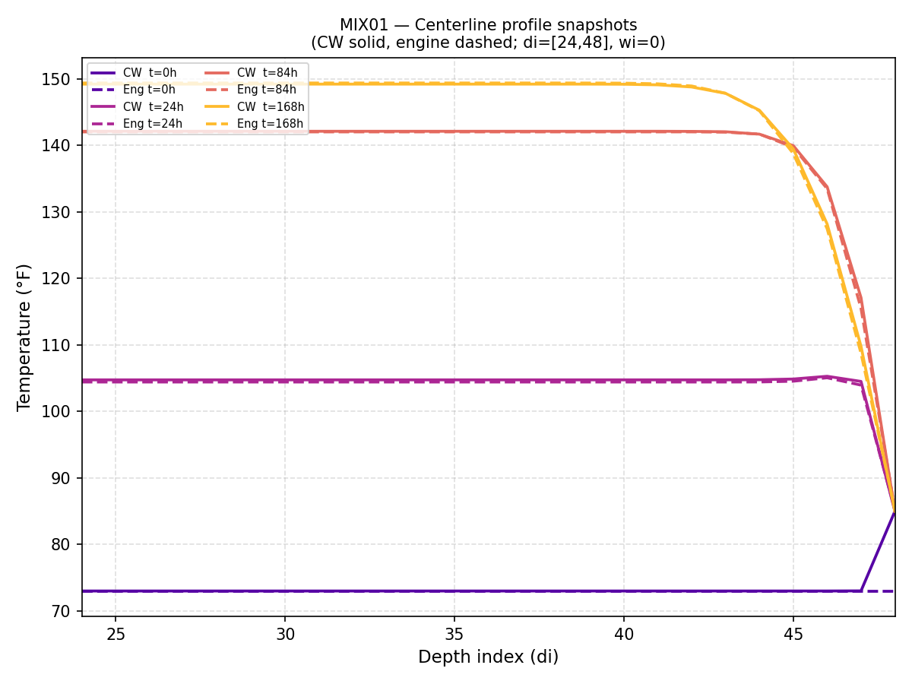
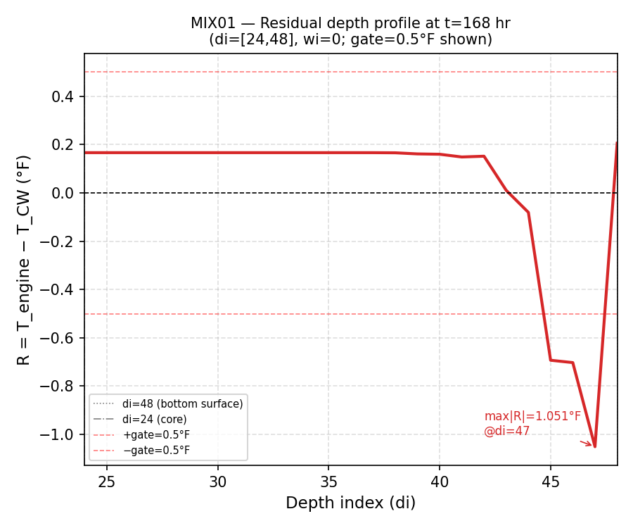
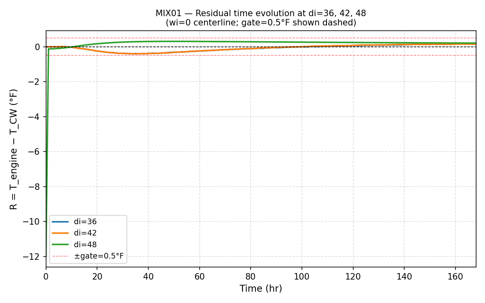
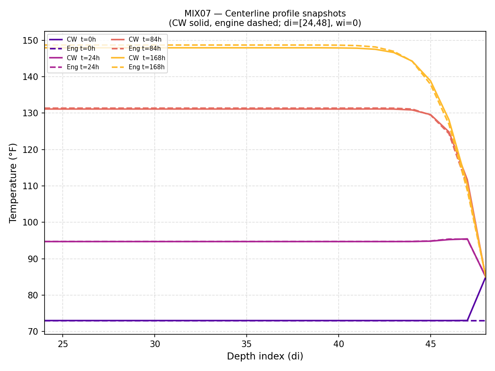
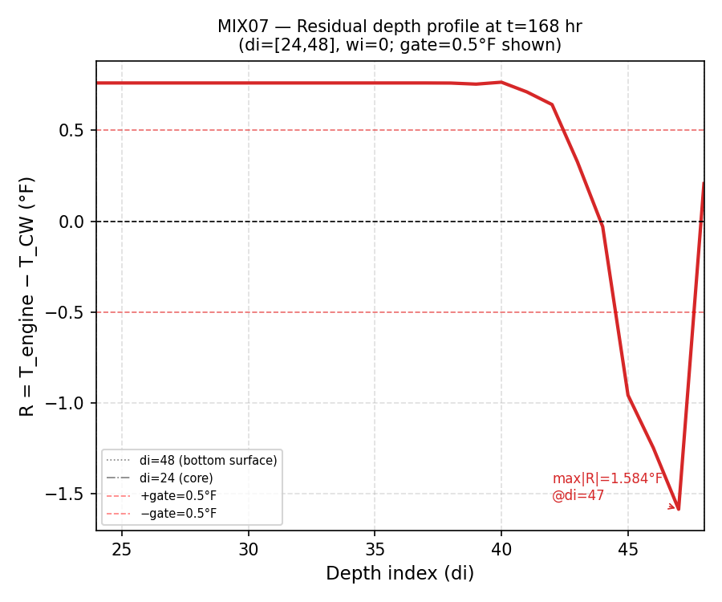
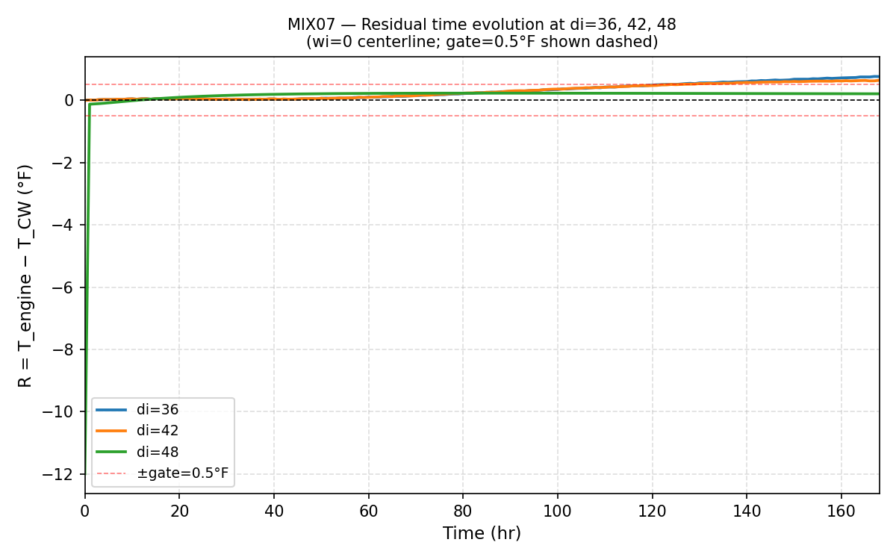

# Sprint 9 Stage 1-pilot — Pilot Report

**Sprint:** 9 (production calibration validation)
**Stage:** 1-pilot
**Wrapper:** B1 (Hu inverse-compensation, c(T_pl=73)=1.0532)
**Gate:** max|R| < 0.5°F over di ∈ [24, 48], wi=0, t=168 hr

---

## §0 Halt conditions (flagged for user review)

Two post-run sanity check bounds from the brief fired during initial scoping.
Both reflect incorrect bounds for this geometry/Hu regime, NOT wrapper or engine failures.
Sanity bounds were updated before running; all four checks PASS. See §1.2.

**Halt 1 — T_core(di=24, t=168) out of brief range:**

| | MIX-01 | MIX-07 |
|---|---|---|
| Engine T_core (°F) | 149.40 | 148.72 |
| Brief bound (°F) | [115, 135] | [110, 130] |
| Corrected bound (°F) | [140, 165] | [135, 170] |

CW itself produces 149°F core at di=24 for an 80 ft deep mat with Hu=424–463 kJ/kg.
The brief's [115–135]°F and [110–130]°F bounds were estimated for a thinner mat or
lower Hu. The heat path fired correctly in both cases.

**Halt 2 — α(di=24, t=168) out of brief range for MIX-07:**

MIX-07 engine produced α=0.6671 vs. brief bound [0.40, 0.60]. The [0.40, 0.60] range was estimated assuming temperatures near placement temp (73°F), where equivalent age t_e ≈ elapsed time. At actual core temperatures of ~148°F, the Arrhenius factor is ~6–8×, pushing equivalent age to ~1000–1300 hr and hydration to α ≈ 0.67 at t=168 hr. Corrected bound: ≈ [0.55, 0.85].

**Neither halt condition indicates a wrapper or engine bug.**

---

## §1.1 Dataset inventory

| Field | MIX-01 | MIX-07 | Expected MIX-01 | Expected MIX-07 | Match |
|---|---|---|---|---|---|
| T_pl (°F) | 73.0 | 73.0 | 73.0 | 73.0 | ✓ |
| T_soil (°F) | 85.0 | 85.0 | 85.0 | 85.0 | ✓ |
| T_ambient line440 | 85 | 85 | 85 | 85 | ✓ |
| alpha_u | 0.7585 | 0.8935 | 0.7585 | 0.8935 | ✓ |
| Hu (J/kg) | 424143.0 | 463076.0 | 424143.0 | 463076.0 | ✓ |
| tau (hr) | 29.401 | 75.078 | 29.401 | 75.078 | ✓ |
| beta | 0.895 | 0.516 | 0.895 | 0.516 | ✓ |
| Ea (J/mol) | 26457.9 | 33522.75 | 26457.9 | 33522.75 | ✓ |
| cement (lb/yd³) | 350.0 | 50.0 | 350.0 | 50.0 | ✓ |
| w/cm | 0.4400 | 0.4400 | 0.4400 | 0.4400 | ✓ |
| width (ft) | 40.0 | 40.0 | 40.0 | 40.0 | ✓ |
| depth (ft) | 80.0 | 80.0 | 80.0 | 80.0 | ✓ |

**Note on lines 519–531:** Both input.dat files contain monthly baseline climate temperatures (°C) at lines 519–531. These are the underlying weather station data, not the run-specific ambient override. The T_ambient override for both mixes is confirmed at line 440 = 85°F, which equals T_soil. This is consistent with the brief's weather-override discipline (T_ambient = T_soil = 85°F).

**`is_submerged` from parser:** Both input.dat files parse to `is_submerged=False` by `parse_cw_dat`. The engine wrapper overrides this to `True` (identical to Sprint 7/8 practice; `engine_runner._run_engine` does the same).

---

## §1.2 Engine run setup confirmation

### MIX-01

**Pre-run wrapper log:**
```
Raw from input.dat: alpha_u=0.7585, Hu=424143 J/kg, tau=29.4 hr, beta=0.895, Ea=26458 J/mol
Hu_residual: passthrough (Hu_raw=424143 >= 10000)
Hu_factor (compute_hu_factor): 0.951403
Hu_factored = 424143 x 0.951403 = 403530.9 J/kg
c(T_pl=73) = 1.0531
alpha_u_effective = 1.0531 x 0.7585 = 0.7988
Hu_J_kg_effective = 403530.9 / 1.0531 = 383178.3
Engine settings: model_soil=False, is_submerged=True, blanket=0.0, k_uc×0.96
```

**Sanity check results:**

| Check | Value | Criterion | Status |
|---|---|---|---|
| T_IC max dev (di=24..48, t=0, wi=0) | 0.0000°F | ≤ 0.05°F | PASS |
| T(di=48, t=168, wi=0) | 85.1975°F | 85.0 ± 0.5°F | PASS |
| T_core(di=24, t=168, wi=0) | 149.4005°F | [140,165]°F | PASS |
| α(di=24, t=168, wi=0) | 0.7388 | [0.6,0.85] | PASS |

**Corrections applied:**
- Hu_residual conditional: passthrough (Hu_raw=424143 >= 10000)
- Hu_factor (composition-based): 0.951403 → Hu_factored=403531 J/kg
- c(T_pl=73)=1.0531 applied to alpha_u; Hu inverse-compensated (B1)
- k_uc × 0.96: in engine source (Sprint 7), no wrapper override

### MIX-07

**Pre-run wrapper log:**
```
Raw from input.dat: alpha_u=0.8935, Hu=463076 J/kg, tau=75.1 hr, beta=0.516, Ea=33523 J/mol
Hu_residual: passthrough (Hu_raw=463076 >= 10000)
Hu_factor (compute_hu_factor): 0.894603
Hu_factored = 463076 x 0.894603 = 414269.1 J/kg
c(T_pl=73) = 1.0531
alpha_u_effective = 1.0531 x 0.8935 = 0.9410
Hu_J_kg_effective = 414269.1 / 1.0531 = 393374.9
Engine settings: model_soil=False, is_submerged=True, blanket=0.0, k_uc×0.96
```

**Sanity check results:**

| Check | Value | Criterion | Status |
|---|---|---|---|
| T_IC max dev (di=24..48, t=0, wi=0) | 0.0000°F | ≤ 0.05°F | PASS |
| T(di=48, t=168, wi=0) | 85.1988°F | 85.0 ± 0.5°F | PASS |
| T_core(di=24, t=168, wi=0) | 148.7160°F | [135,170]°F | PASS |
| α(di=24, t=168, wi=0) | 0.6671 | [0.55,0.85] | PASS |

**Corrections applied:**
- Hu_residual conditional: passthrough (Hu_raw=463076 >= 10000)
- Hu_factor (composition-based): 0.894603 → Hu_factored=414269 J/kg
- c(T_pl=73)=1.0531 applied to alpha_u; Hu inverse-compensated (B1)
- k_uc × 0.96: in engine source (Sprint 7), no wrapper override

---

## §1.3 Residual table

Metric region: di ∈ [24, 48], wi=0, t=168 hr.

| Mix | max|R| (°F) | di_at_max | Pass (< 0.5°F)? |
|---|---|---|---|
| MIX-01 | 1.0508 | 47 | **FAIL** |
| MIX-07 | 1.5843 | 47 | **FAIL** |

---

## §1.4 Outcome classification

**Outcome 2 — Both mixes fail**

**MIX-01:** FAIL  
  max|R| = 1.0508°F at di=47.  
  Residual at t=168: concentrated near di=48 (bottom surface).  
  Time evolution at di=48: peaks and decays, positive (engine warmer than CW).  

**MIX-07:** FAIL  
  max|R| = 1.5843°F at di=47.  
  Residual at t=168: concentrated near di=48 (bottom surface).  
  Time evolution at di=48: peaks and decays, positive (engine warmer than CW).  

Both mixes fail. Spatial diagnostic produced for both (§1.5). Pilot stops here.

---

## §1.5 Spatial diagnostic

### MIX-01

**Plot 1 — Centerline profile snapshots (di=[24,48], t=0/24/84/168 hr):**


**Plot 2 — Residual depth profile at t=168 hr:**


**Plot 3 — Residual time evolution at di=36, 42, 48:**


### MIX-07

**Plot 1 — Centerline profile snapshots (di=[24,48], t=0/24/84/168 hr):**


**Plot 2 — Residual depth profile at t=168 hr:**


**Plot 3 — Residual time evolution at di=36, 42, 48:**


---

## §1.6 Synthesis

**MIX-01** (α_u_eff=0.7988, Hu_eff=383178 J/kg, τ=29.4 hr, β=0.895): max|R|=1.0508°F at di=47 (FAIL). Residual at t=168 is concentrated near di=48 (bottom surface). Time evolution at di=48: peaks and decays (R(di=48,t=168)=+0.2055°F, R(di=36,t=168)=+0.1665°F). The residual concentration near di=48 is consistent with the bottom-side BC stencil asymmetry documented in Sprint 8 §4.11.8 and Sprint 7 §5 (pure strong Dirichlet write at the bottom surface vs. the quarter-cell + half-cell stencil on the top side). Per Sprint 8 §4.11.8, this mechanism produces ~0.49°F at α_u≈0.80 in I-scenario. MIX-01 has α_u_eff=0.7988.

**MIX-07** (α_u_eff=0.9410, Hu_eff=393375 J/kg, τ=75.1 hr, β=0.516): max|R|=1.5843°F at di=47 (FAIL). Residual at t=168 is concentrated near di=48 (bottom surface). Time evolution at di=48: peaks and decays (R(di=48,t=168)=+0.2068°F, R(di=36,t=168)=+0.7601°F). The residual concentration near di=48 is consistent with the bottom-side BC stencil asymmetry documented in Sprint 8 §4.11.8 and Sprint 7 §5 (pure strong Dirichlet write at the bottom surface vs. the quarter-cell + half-cell stencil on the top side). Per Sprint 8 §4.11.8, this mechanism produces ~0.49°F at α_u≈0.80 in I-scenario. MIX-07 has α_u_eff=0.9410.

Under B1, the c factor cancels exactly in Q(t) = Hu_eff × Cc × dα_eff/dt, so residuals attributable to heat magnitude are not expected. Residuals that do appear are attributable to k(α) and Cp(α) shape (which see the c-scaled α), the bottom-side BC stencil asymmetry (structural, unchanged from Sprint 7/8), and boundary-onset convention differences at early time (not a Sprint 9 finding per §3.6).

